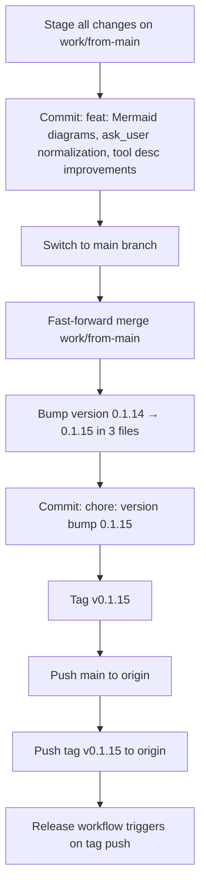

# Plan: Patch v0.1.15 Release

## Context

The user wants to release a new patch version of Claudinio Code. The current version is `0.1.14` (tag `v0.1.14` exists). There are uncommitted changes in the working tree on branch `work/from-main` (which is at the same commit as `origin/main`):

- **Mermaid diagram rendering**: new `mermaid` dep in package.json, new files `src/lib/mermaid.ts`, `src/lib/mermaidViewer.ts`, `src/components/MermaidViewerModal.tsx`, `src/components/ProseContent.tsx`, changes to `src/App.tsx`, `src/App.css`, `src/components/ChatPanel.tsx`, `src/components/tool-renderers/ToolBody.tsx`, and a Brain system-prompt addition in `src-tauri/src/agent/session.rs` encouraging Mermaid diagrams.
- **ask_user input normalization**: `normalize_ask_user_questions` + `ask_user_error_with_example` in `session.rs` with 4 new unit tests, plus `QuestionCard.tsx` / `QuestionCard.test.tsx` changes.
- **Tool description improvements**: `grep`, `edit_file`, `go_to_definition`, `find_references` descriptions in `src-tauri/src/agent/tools/mod.rs`.
- **Cargo workspace fix**: `[workspace]` table added to `src-tauri/Cargo.toml` to prevent the worktree from being absorbed into the parent workspace.
- **Minor**: `CommitPushModal.tsx`, `src/lib/ipc.ts`, `src-tauri/src/commands/fs.rs`, `src-tauri/src/lib.rs`, `ToolBody.test.tsx`.

User decisions (confirmed):
1. Commit the uncommitted changes into this release.
2. Version: **0.1.15** (patch bump).
3. One feat commit for all changes + a separate `chore: version bump 0.1.15` commit, then tag `v0.1.15`.
4. Merge to `main` and push (to trigger the release workflow).

## Solution Design

### Release flow



### Version bump — 3 files, all at line 3 or 4

| File | Line | Current | New |
|------|------|---------|-----|
| `package.json` | 3 | `"version": "0.1.14"` | `"version": "0.1.15"` |
| `src-tauri/tauri.conf.json` | 4 | `"version": "0.1.14"` | `"version": "0.1.15"` |
| `src-tauri/Cargo.toml` | 3 | `version = "0.1.14"` | `version = "0.1.15"` |

### Commit structure

1. **feat commit** (on `work/from-main`):
   - Stage all 16 modified + 4 untracked files explicitly (no `git add .`).
   - Message: `feat: Mermaid diagram rendering + viewer, ask_user input normalization, tool description improvements`
2. **version bump commit** (on `main` after merge):
   - Stage only the 3 version files.
   - Message: `chore: version bump 0.1.15`
3. **Tag**: `v0.1.15` (annotated, lightweight is fine too — workflow triggers on either).

### Release workflow

The tag push triggers `.github/workflows/release.yml` which:
- Builds 5 platforms (Windows x64/ARM64, macOS ARM64, Linux x64/ARM64).
- Generates `latest.json` updater manifest.
- Publishes to `claudin-io/claudinio-code-releases` (public releases repo).

The workflow runs in the `RELEASE` environment with secrets for signing. We do NOT need to run the build locally — CI handles it.

## Risks

- **Uncommitted ChatPanel.tsx is binary-ish** (large diff) — it's a real source file, just large; staging it is fine.
- **pnpm-lock.yaml changed** — this is from adding the `mermaid` dependency; must be staged with the feat commit so `pnpm install --frozen-lockfile` succeeds in CI.
- **Push to main** — this is an external/destructive operation; user has explicitly authorized "Merge to main and push".
- **Tag push triggers CI** — the release workflow needs `RELEASE` environment secrets; if those are misconfigured the build fails but the tag is already pushed. This is the normal release flow though.

## Non-goals

- Running the full Tauri build locally (CI handles it).
- Creating GitHub release notes manually (the workflow auto-generates them).
- Modifying the release workflow itself.
- Running `pnpm test` / `cargo test` before tagging (the user didn't ask for it and CI doesn't gate on it — the tag push is the trigger).

## Low-Level Design

### Files to stage for the feat commit (20 files total)

**Modified (16):**
- `package.json` — adds `mermaid` dependency
- `pnpm-lock.yaml` — lockfile update for mermaid
- `src-tauri/Cargo.toml` — `[workspace]` table
- `src-tauri/src/agent/session.rs` — Mermaid prompt + ask_user normalization + tests
- `src-tauri/src/agent/tools/mod.rs` — tool description improvements
- `src-tauri/src/commands/fs.rs` — minor changes
- `src-tauri/src/lib.rs` — minor changes
- `src/App.css` — Mermaid viewer styles
- `src/App.tsx` — MermaidViewerModal mount
- `src/components/ChatPanel.tsx` — ProseContent usage
- `src/components/CommitPushModal.tsx` — minor changes
- `src/components/QuestionCard.test.tsx` — updated tests
- `src/components/QuestionCard.tsx` — updated rendering
- `src/components/tool-renderers/ToolBody.test.tsx` — updated tests
- `src/components/tool-renderers/ToolBody.tsx` — ProseContent usage
- `src/lib/ipc.ts` — minor changes

**Untracked (4):**
- `src/components/MermaidViewerModal.tsx` — fullscreen diagram viewer
- `src/components/ProseContent.tsx` — prose renderer with Mermaid support
- `src/lib/mermaid.ts` — lazy Mermaid loader
- `src/lib/mermaidViewer.ts` — global viewer store

### Files to stage for the version bump commit (3 files)

- `package.json` line 3: `0.1.14` → `0.1.15`
- `src-tauri/tauri.conf.json` line 4: `0.1.14` → `0.1.15`
- `src-tauri/Cargo.toml` line 3: `0.1.14` → `0.1.15`

### Git commands (exact sequence)

```bash
# 1. Stage all changes on work/from-main
git add package.json pnpm-lock.yaml src-tauri/Cargo.toml \
  src-tauri/src/agent/session.rs src-tauri/src/agent/tools/mod.rs \
  src-tauri/src/commands/fs.rs src-tauri/src/lib.rs \
  src/App.css src/App.tsx \
  src/components/ChatPanel.tsx src/components/CommitPushModal.tsx \
  src/components/QuestionCard.test.tsx src/components/QuestionCard.tsx \
  src/components/tool-renderers/ToolBody.test.tsx src/components/tool-renderers/ToolBody.tsx \
  src/lib/ipc.ts \
  src/components/MermaidViewerModal.tsx src/components/ProseContent.tsx \
  src/lib/mermaid.ts src/lib/mermaidViewer.ts

# 2. Feat commit
git commit -m "feat: Mermaid diagram rendering + viewer, ask_user input normalization, tool description improvements"

# 3. Switch to main and merge
git checkout main
git merge work/from-main --ff-only

# 4. Bump version (edit 3 files)
# 5. Stage and commit version bump
git add package.json src-tauri/tauri.conf.json src-tauri/Cargo.toml
git commit -m "chore: version bump 0.1.15"

# 6. Tag
git tag v0.1.15

# 7. Push (triggers release workflow)
git push origin main
git push origin v0.1.15
```

### Verification

- `git log --oneline -3` shows the version bump commit at HEAD on main.
- `git tag --sort=-v:refname | head -1` shows `v0.1.15`.
- `grep '"version"' package.json` shows `0.1.15`.
- `grep 'version' src-tauri/tauri.conf.json | head -1` shows `0.1.15`.
- `grep '^version' src-tauri/Cargo.toml` shows `0.1.15`.
- GitHub Actions tab shows the Release workflow running for tag `v0.1.15`.

## Tasks summary

1. Stage and commit all uncommitted changes as a single feat commit on `work/from-main`.
2. Switch to `main`, fast-forward merge from `work/from-main`.
3. Bump version `0.1.14` → `0.1.15` in `package.json`, `src-tauri/tauri.conf.json`, `src-tauri/Cargo.toml`.
4. Commit the version bump, tag `v0.1.15`.
5. Push `main` and tag `v0.1.15` to origin (triggers release workflow).
6. Verify the release workflow is triggered and tag/commits are correct.


## Implementation Log — 2026-07-20 23:25
**Summary:** Release v0.1.15: feat commit, merge to main, version bump, tag, push
**Changed files:** A	docs/plans/2026-07-20_patch-v0-1-15-release.md, M	package.json, M	pnpm-lock.yaml, M	src-tauri/Cargo.toml, M	src-tauri/src/agent/session.rs, M	src-tauri/src/agent/tools/mod.rs, M	src-tauri/src/commands/fs.rs, M	src-tauri/src/lib.rs, M	src-tauri/tauri.conf.json, M	src/App.css, M	src/App.tsx, M	src/components/ChatPanel.tsx, M	src/components/CommitPushModal.tsx, A	src/components/MermaidViewerModal.tsx, A	src/components/ProseContent.tsx, M	src/components/QuestionCard.test.tsx, M	src/components/QuestionCard.tsx, M	src/components/tool-renderers/ToolBody.test.tsx, M	src/components/tool-renderers/ToolBody.tsx, M	src/lib/ipc.ts, A	src/lib/mermaid.ts, A	src/lib/mermaidViewer.ts
**Commits:** 8fc3ee3 chore: version bump 0.1.15, af5a951 feat: Mermaid diagram rendering + viewer, ask_user input normalization, tool description improvements, 767baab docs(plan): patch-v0-1-15-release
**Journal:** Release v0.1.15 completed end-to-end:
- All uncommitted work (Mermaid rendering/viewer, ask_user normalization, tool desc improvements) was staged, committed, fast-forward merged to main
- Version bumped in package.json, tauri.conf.json, Cargo.toml from 0.1.14→0.1.15
- Tagged v0.1.15 and pushed to origin
- Release workflow is configured on tag push pattern v[0-9]+.[0-9]+.[0-9]+ — triggered automatically
- GitHub API is gated (private repo) so release run status can't be checked via curl, but push confirmed success

**Task journal:**
- Stage and commit all uncommitted changes as feat commit: Staged 16 modified + 4 new files individually (no git add .).; Committed with 20 files, 1726 insertions, 36 deletions, 4 new files created.
- Switch to main and fast-forward merge: git checkout main, git merge work/from-main --ff-only.; HEAD: af5a951 feat: Mermaid diagram rendering + viewer, ask_user input normalization, tool description improvements
- Bump version to 0.1.15, commit, and tag: All 3 files bumped from 0.1.14 → 0.1.15.; Commit: 8fc3ee3 chore: version bump 0.1.15; Tag: v0.1.15
- Push main and tag v0.1.15 to origin: git push origin main (0e61c0a..8fc3ee3 → main); git push origin v0.1.15 (new tag)
- Verify release is triggered and version is correct: HEAD: 8fc3ee3 chore: version bump 0.1.15 ✅; Tag v0.1.15 exists ✅; All 3 files at 0.1.15 ✅; Push to origin succeeded ✅; Release workflow configured on tag push, trigger fired ✅ (GitHub API gated for private repo)
