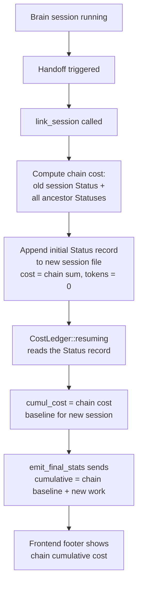

# Chain Cumulative Cost — Brain→Builder Handoff Cost Persistence

## Context

When the user switches from Brain to Builder mode (or any session handoff via golden flip / context threshold), Claudinio Code creates a **new session file** via `link_session`. The new session's cost ledger starts at zero — the old session's accumulated cost is left behind. The footer resets to $0.0000, making it impossible to track total spend across a work chain.

**User confirmed decisions:**
- Footer shows cumulative cost of the ENTIRE chain (all linked sessions: Brain→Builder→Brain→Builder...), not just the current session
- Cost only (not tokens) accumulates across the chain — per-session tokens remain for context management
- No new UI elements — the existing footer is the single display point

## Solution Design

### Strategy: Seed the successor session's initial `Status` record with chain cost

When `link_session` creates a new session, compute the cumulative cost from ALL predecessors (including the old session itself) and append an initial `Status` record to the new session file. This record serves as the baseline for the new session's `CostLedger`, which already knows how to resume from a `Status` record.

**Why this approach:**
- **Zero frontend changes.** The existing `SessionStats` → `contextStats` → `ContextFooter` pipeline works unchanged.
- **Works for both live and reload.** Live `SessionStats` sends the ledger's cumulative (which now includes chain baseline). `load_session` → `getSessionStats` also picks up the chain `Status` record.
- **Minimal new code.** One new function in `persist.rs`, a few lines in `link_session`.
- **No event schema changes.** `SessionLinked`, `SessionStats`, `LinkedFrom` — all unchanged.

### Data flow



### What the user sees

| Moment | Before (current) | After (this change) |
|---|---|---|
| Brain finishes plan, cost at $0.1234 | Footer: $0.1234 | Footer: $0.1234 |
| Builder session starts (handoff) | Footer: $0.0000 ❌ | Footer: $0.1234 ✅ |
| Builder does work worth $0.0220 | Footer: $0.0220 | Footer: $0.1454 |
| Builder finishes | Footer: $0.0220 | Footer: $0.1454 |

### Token behavior (unchanged)

Per-session tokens (`cumul_in`, `cumul_out`) are NOT seeded from the chain — the `Status` record we append sets `total_input_tokens = 0` and `total_output_tokens = 0`. Tokens reset per session for accurate context management. The footer's "total tokens" shows per-session tokens (unchanged). Only the cost fields carry the chain accumulation.

## Risks

| Risk | Mitigation |
|---|---|
| Chain walk hits a cycle (shouldn't happen — already guarded in `load_session`) | Add cycle guard (max 64 hops + `HashSet` seen set) |
| Old session file has no `Status` record (cost tracking not configured) | Return `None` for all cost fields; skip appending initial `Status` |
| Initial `Status` with tokens=0 but cost>0 confuses something downstream | `CostLedger::resuming` handles `Option<f64>` for cost fields independently of token fields — no coupling |
| Performance: chain walk on every handoff | Chain depth is typically 2-3. Max 64 hops guarded. One-time cost at handoff, not per-run. |

## Non-goals

- **NOT** changing token accumulation across sessions (tokens stay per-session)
- **NOT** changing `list_sessions` to show chain cost in the session list
- **NOT** adding cost fields to `SessionLinked` event or `LinkedFrom` record
- **NOT** changing the `SessionStats` event schema
- **NOT** changing frontend code at all

## Low-Level Design

### Change 1: New function `chain_cumulative_cost` in `persist.rs`

Add a public function that walks the chain backward from a given session id, accumulating cost from all `Status` records.

**File:** `src-tauri/src/agent/persist.rs`
**Location:** After the existing `cumulative_stats` function (~line 568), before the `SessionSummary` section.

```rust
/// Walk the session chain backward (via LinkedFrom) and accumulate every
/// session's last Status record into a single cumulative cost tuple.
/// Returns (total_cost, cost_input, cost_output, cost_cache_read) — all Options.
/// Returns all None if no session in the chain has cost data.
pub fn chain_cumulative_cost(
    workspace_root: Option<&str>,
    start_session_id: &str,
) -> (Option<f64>, Option<f64>, Option<f64>, Option<f64>) {
    let dir = match sessions_dir(workspace_root) {
        Ok(d) => d,
        Err(_) => return (None, None, None, None),
    };

    let mut total_cost: Option<f64> = None;
    let mut cost_input: Option<f64> = None;
    let mut cost_output: Option<f64> = None;
    let mut cost_cache_read: Option<f64> = None;

    let mut current_id = start_session_id.to_string();
    let mut seen: std::collections::HashSet<String> = std::collections::HashSet::new();
    const MAX_HOPS: usize = 64;

    for _ in 0..MAX_HOPS {
        if !seen.insert(current_id.clone()) {
            break; // cycle guard
        }

        let path = dir.join(format!("{current_id}.jsonl"));
        let Ok(records) = load_records(&path) else {
            break;
        };

        // Accumulate this session's cost from its last Status record.
        let (_, _, tc, ci, co, cc) = cumulative_stats(&records);
        if let Some(c) = tc {
            total_cost = Some(total_cost.unwrap_or(0.0) + c);
        }
        if let Some(c) = ci {
            cost_input = Some(cost_input.unwrap_or(0.0) + c);
        }
        if let Some(c) = co {
            cost_output = Some(cost_output.unwrap_or(0.0) + c);
        }
        if let Some(c) = cc {
            cost_cache_read = Some(cost_cache_read.unwrap_or(0.0) + c);
        }

        // Walk to predecessor.
        match linked_from_info(&records) {
            Some(info) => current_id = info.prev_session_id,
            None => break,
        }
    }

    (total_cost, cost_input, cost_output, cost_cache_read)
}
```

**Dependencies:**
- `sessions_dir` — already exists in `persist.rs` (used by `list_sessions`, `SessionStore::create`)
- `load_records` — already exists in `persist.rs`
- `cumulative_stats` — already exists at `persist.rs:514-568`
- `linked_from_info` — needs to be created as a thin wrapper around the existing `linked_from` function. The existing function `linked_from` at `persist.rs:215-233` returns `Option<LinkedFromInfo>`. It reads from a `&[SessionRecord]` slice. The new function should call it.

Wait — checking `persist.rs:215`, the function is named `linked_from`. Let me verify: from the investigation, "`linked_from` — persist.rs:215–233: `records.iter().find_map(...)` for the first `LinkedFrom` record, returning `LinkedFromInfo`". So the existing function is `linked_from(records: &[SessionRecord]) -> Option<LinkedFromInfo>`. Perfect — we call it directly, no wrapper needed.

### Change 2: Append initial `Status` record in `link_session`

**File:** `src-tauri/src/agent/transition.rs`
**Location:** After step 6 (Mode append at ~line 99), before step 7 (steering swap comment at ~line 103).

Insert after the Mode append block:

```rust
    // 6½. Seed the successor's cost ledger with cumulative chain cost
    // so the footer never drops to zero on handoff — each session
    // inherits the cost of its entire ancestry.
    {
        let chain_cost = persist::chain_cumulative_cost(
            workspace_root.as_deref(),
            &old_handle.id,
        );
        if chain_cost.0.is_some()
            || chain_cost.1.is_some()
            || chain_cost.2.is_some()
            || chain_cost.3.is_some()
        {
            new_store.try_append(&SessionRecord::Status {
                total_input_tokens: 0,
                total_output_tokens: 0,
                total_cost: chain_cost.0,
                total_cost_input: chain_cost.1,
                total_cost_output: chain_cost.2,
                total_cost_cache_read: chain_cost.3,
                context_tokens: None,
                ts: now_ms(),
            });
        }
    }
```

**Note:** `workspace_root` is already computed at line 41: `let workspace_root = Some(ws.root.to_string_lossy().to_string());`. We use `workspace_root.as_deref()`.

### What does NOT change

| Component | File | Reason |
|---|---|---|
| `CostLedger` struct & `resuming()` | `run_state.rs` | Already resumes from last `Status` — reads the chain `Status` we appended |
| `emit_final_stats` closure | `session.rs:1599` | Sends `cumul_*` from ledger — now includes chain baseline |
| `SessionStats` event | `session.rs:755` | Schema unchanged |
| `SessionLinked` event & handler | `session.rs:746`, `ChatPanel.tsx:836` | No cost fields added; handler unchanged |
| `load_session` | `agent.rs:587` | Chain walk already concatenates records; our `Status` is in the chain |
| `getSessionStats` | `ipc.ts:490` | Last `Status` wins — sees chain `Status` |
| `ContextFooter` | `TimelineRows.tsx:95` | Renders `contextStats` — unchanged |
| `session.rs` run loop | `session.rs:1594` | `CostLedger::resuming(cumulative_stats(records))` on the new file — reads our `Status` |
| `HandoffSpec` / `LinkedFrom` / `HandoffTo` | `persist.rs`, `session.rs` | Schema unchanged |

### How the live `SessionStats` feed works after the change

The successor session's `run_workflow` starts (`session.rs`), builds the ledger from the new file's records:

```
session.rs:1594: let records = load_records_cached(&store.path, ...);
session.rs:1598: let cumul = cumulative_stats(&records);
```

`cumulative_stats` reads the last `Status` — which is our chain-cost `Status` (input=0, output=0, cost=chain_sum). The ledger seeds `cumul_in=0`, `cumul_out=0`, `cumul_cost=chain_sum`.

When the Builder does its first work and `emit_final_stats` fires:

```
session.rs:1599: emit_final_stats(ledger, context_tokens)
  → SessionStats {
      input_tokens: ledger.cumul_in,   // 0 + new work tokens
      output_tokens: ledger.cumul_out, // 0 + new work tokens
      cumulative_cost: ledger.cumul_cost, // chain_sum + new work cost
      ...
    }
```

Frontend receives this and sets `contextStats`:
- `cumulativeTokens: data.inputTokens + data.outputTokens` — per-session tokens only
- `estimatedCost: data.cumulativeCost` — chain cumulative cost ✅

### Edge cases

| Scenario | Behavior |
|---|---|
| First session in chain (no predecessors) | `chain_cumulative_cost` accumulates only the old session's cost → returns it. `Status` appended with that cost. |
| Chain with no cost data (no provider pricing) | All `Option<f64>` are `None` → no `Status` appended. Behavior unchanged from today. |
| 64+ hop chain | Cycle guard at 64 hops stops. In practice chains are 2-3 deep. |
| Corrupted predecessor file | `load_records` returns `Err` → loop breaks. Partial accumulation is used (cost from reachable sessions). |
| Old session has cost but no tokens | `total_input_tokens: 0, total_output_tokens: 0` in the seed `Status`. Tokens start fresh. Cost carries over. ✅ |
| Multiple handoffs (Brain→Builder→Brain→Builder) | Each `link_session` call appends a `Status` with the growing chain cost. Cost accumulates correctly at each hop. |

### Verification Plan

1. **Compile:** `cargo build` in `src-tauri/` — must succeed with no warnings
2. **Unit test (optional):** Add a test for `chain_cumulative_cost` with 2-3 linked session files — verify correct summation
3. **Manual E2E:**
   - Start a Brain session, let it do work that generates cost (use a cheap model)
   - Note the footer cost (e.g., $0.0123)
   - Switch to Builder via the "Continue with Builder" button
   - **Assert:** Footer cost does NOT reset to $0.0000 — it shows ≥$0.0123
   - Let Builder do more work
   - **Assert:** Footer cost increases from the baseline (e.g., $0.0123 → $0.0156)
4. **Reload test:**
   - After the handoff, reload the page
   - **Assert:** Footer still shows chain cumulative cost (not zero)
5. **Regression:**
   - New session (no chain) — footer starts at $0.0000 as before
   - Token count — still per-session, resets on handoff

## Tasks Summary

1. **Add `chain_cumulative_cost` function** — new function in `src-tauri/src/agent/persist.rs` that walks chain backward summing `Status` cost fields
2. **Seed successor `Status` in `link_session`** — append initial `Status` record with chain cost in `src-tauri/src/agent/transition.rs` step 6½
3. **Build & verify** — compile, manual E2E test confirming footer doesn't reset on handoff
