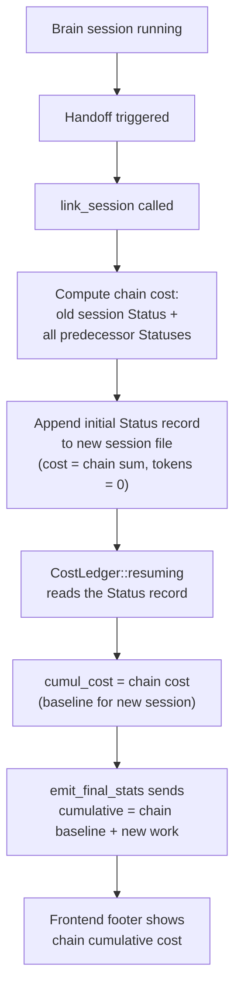

# Chain Cumulative Cost — Brain→Builder Handoff Cost Persistence

## Context / Problem Statement

When the user switches from Brain to Builder mode (or any session handoff via golden flip / context threshold), Claudinio Code creates a **new session file** via `link_session`. The new session's cost ledger starts at zero — the old session's accumulated cost is left behind. The footer resets to $0.0000, making it impossible to track total spend across a work chain.

**Confirmed:** The user wants the footer to show the cumulative cost of the **entire chain** (all linked sessions: Brain→Builder→Brain→Builder...), not just the current session.

## Goal (Definition of Done)

The footer always displays the cumulative cost summed across ALL sessions in the chain (from the oldest ancestor through the current tip). After a Brain→Builder handoff, the displayed cost does NOT drop; it continues from where the Brain session left off.

## Key Findings (Real Proof)

| Finding | Source |
|---|---|
| `link_session` copies no cost/token data to successor | `transition.rs:31-139` — only `LinkedFrom`, `BaseCommit`, tasks, `Mode` |
| Successor `CostLedger` seeds from empty file → all zeros | `session.rs:1594-1598` → `CostLedger::resuming(cumul)` with `cumulative_stats()` on empty file |
| `SessionLinked` handler does NOT touch `contextStats` | `ChatPanel.tsx:836-873` — only stitches messages, swaps `activeSessionId` |
| Live `SessionStats` overwrites `contextStats` with ledger values | `ChatPanel.tsx:959-968` — `cumulativeTokens` = `data.inputTokens + data.outputTokens`, `estimatedCost = data.cumulativeCost` |
| `SessionStats` event has `cumulativeCost`, `costInput`, `costOutput`, `costCacheRead` | `session.rs:755-774` |
| `load_session` concatenates ALL chain records into one flat list | `agent.rs:635` |
| `getSessionStats` reads the LAST `status` record | `ipc.ts:500-528` — overwrite loop |
| `CostLedger` has 14 fields; cumulatives are `cumul_in/out`, `cumul_cost(_input/_output/_cache)` | `run_state.rs:20-37` |
| `emit_final_stats` sends `cumul_in/out`, `cumul_cost(_input/_output/_cache)` | `session.rs:1599-1610` |
| No `workgroup` or `group_cost` concept exists anywhere | Grep across entire repo → 0 hits |

## Authoritative Inputs

- **User decision:** Footer shows cumulative cost of the ENTIRE chain (all handoffs summed)
- **User decision:** Cost only (not tokens) accumulates across the chain. Per-session tokens remain for context management.
- **Plan file path:** `docs/plans/YYYY-MM-DD_chain-cumulative-cost.md`

## Solution Design

### Strategy: Seed the successor session's initial `Status` record with chain cost

When `link_session` creates a new session, compute the cumulative cost from ALL predecessors (including the old session itself) and append an initial `Status` record to the new session file. This record serves as the baseline for the new session's `CostLedger`, which already knows how to resume from a `Status` record.

**Why this approach:**
- **Zero frontend changes.** The existing `SessionStats` → `contextStats` → `ContextFooter` pipeline works unchanged.
- **Works for both live and reload.** Live `SessionStats` sends the ledger's cumulative (which now includes chain baseline). `load_session` → `getSessionStats` also picks up the chain `Status` record.
- **Minimal new code.** One new function in `persist.rs`, 3 lines in `link_session`.
- **No event schema changes.** `SessionLinked`, `SessionStats`, `LinkedFrom` — all unchanged.

### Data flow



### What changes in the footer

- **Before:** After Brain→Builder handoff, cost drops from e.g. $0.1234 to $0.0000
- **After:** After handoff, cost stays at $0.1234 (chain baseline), then grows as Builder does work: $0.1234 → $0.1456 → ...

### Token behavior (unchanged)

Per-session tokens (`cumul_in`, `cumul_out`) are NOT seeded from the chain — the `Status` record we append sets `total_input_tokens = 0` and `total_output_tokens = 0`. Tokens reset per session for accurate context management. The footer's "total tokens" will show per-session tokens (unchanged behavior). Only the cost fields carry the chain accumulation.

## Risks

| Risk | Mitigation |
|---|---|
| Chain walk hits a cycle (shouldn't happen — already guarded in `load_session`) | Add cycle guard (max 64 hops + seen set) |
| Old session file has no `Status` record (cost tracking not configured) | Return `None` for all cost fields; skip appending initial `Status` |
| Initial `Status` with tokens=0 but cost>0 confuses something downstream | `CostLedger::resuming` handles `Option<f64>` for cost fields independently of token fields — no coupling |
| Performance: chain walk on every handoff | Chain depth is typically 2-3 (Brain→Builder). Max 64 hops guarded. One-time cost at handoff, not per-run. |

## Non-goals

- **NOT** changing token accumulation across sessions (tokens stay per-session)
- **NOT** changing `list_sessions` to show chain cost in the session list
- **NOT** adding cost fields to `SessionLinked` event or `LinkedFrom` record
- **NOT** changing the `SessionStats` event schema
- **NOT** changing frontend code at all

## Low-Level Design

### Change 1: New function `chain_cumulative_cost` in `persist.rs`

Add a public function that walks the chain backward from a given session id, accumulating cost from all `Status` records.

```rust
/// Walk the session chain backward (via LinkedFrom) and accumulate every
/// session's last Status record into a single cumulative cost tuple.
/// Returns (total_cost, cost_input, cost_output, cost_cache_read) — all Options.
/// Returns all None if no session in the chain has cost data.
pub fn chain_cumulative_cost(
    workspace_root: Option<&str>,
    start_session_id: &str,
) -> (Option<f64>, Option<f64>, Option<f64>, Option<f64>) {
    let dir = sessions_dir(workspace_root).ok();
    let dir = match dir {
        Some(d) => d,
        None => return (None, None, None, None),
    };

    let mut total_cost: Option<f64> = None;
    let mut cost_input: Option<f64> = None;
    let mut cost_output: Option<f64> = None;
    let mut cost_cache_read: Option<f64> = None;

    let mut current_id = start_session_id.to_string();
    let mut seen: std::collections::HashSet<String> = std::collections::HashSet::new();
    const MAX_HOPS: usize = 64;

    for _ in 0..MAX_HOPS {
        if !seen.insert(current_id.clone()) {
            break; // cycle guard
        }

        let path = dir.join(format!("{current_id}.jsonl"));
        let Ok(records) = load_records(&path) else {
            break;
        };

        // Accumulate this session's cost from its last Status record.
        let (_, _, tc, ci, co, cc) = cumulative_stats(&records);
        if let Some(c) = tc {
            total_cost = Some(total_cost.unwrap_or(0.0) + c);
        }
        if let Some(c) = ci {
            cost_input = Some(cost_input.unwrap_or(0.0) + c);
        }
        if let Some(c) = co {
            cost_output = Some(cost_output.unwrap_or(0.0) + c);
        }
        if let Some(c) = cc {
            cost_cache_read = Some(cost_cache_read.unwrap_or(0.0) + c);
        }

        // Walk to predecessor.
        let info = linked_from_info(&records);
        match info {
            Some(i) => current_id = i.prev_session_id,
            None => break,
        }
    }

    (total_cost, cost_input, cost_output, cost_cache_read)
}
```

**File:** `src-tauri/src/agent/persist.rs`
**Location:** After the existing `cumulative_stats` function (~line 568), before the `SessionSummary` section.

**Note:** The `linked_from` function returns `Option<LinkedFromInfo>`. I need to verify its exact signature — from the investigation, it's at `persist.rs:215-233`. The `LinkedFromInfo` struct is at `persist.rs:203-211` with field `prev_session_id`.

### Change 2: Append initial `Status` record in `link_session`

In `transition.rs`, after step 6 (Mode append, line ~99) and before step 7 (steering swap), add:

```rust
// 6½. Seed the successor's cost ledger with cumulative chain cost.
// This ensures the footer never drops to zero on handoff — each session
// inherits the cost of its entire ancestry.
let chain_cost = persist::chain_cumulative_cost(
    Some(ws.root.to_string_lossy().to_string()).as_deref(),
    &old_handle.id,
);
if chain_cost.0.is_some() || chain_cost.1.is_some() || chain_cost.2.is_some() || chain_cost.3.is_some() {
    new_store.try_append(&SessionRecord::Status {
        total_input_tokens: 0,
        total_output_tokens: 0,
        total_cost: chain_cost.0,
        total_cost_input: chain_cost.1,
        total_cost_output: chain_cost.2,
        total_cost_cache_read: chain_cost.3,
        context_tokens: None,
        ts: now_ms(),
    });
}
```

**File:** `src-tauri/src/agent/transition.rs`
**Location:** After line ~99 (Mode append), before line ~103 (steering swap comment).

### Change 3: Update `chain_cumulative_cost` to also include the OLD session's cost

The function walks backward from `start_session_id`. But `start_session_id` is `old_handle.id` — the session being superseded. It already HAS cost accumulated. So the walk starts from the old session, includes it, then goes to its predecessors. This is correct.

Wait — I need to think about this more carefully. The `old_records` are already loaded in `link_session` at line 46. So the old session's `Status` is in those records. But `chain_cumulative_cost` loads the old session's file again. That's fine — `load_records` is idempotent, and the `HandoffTo` has already been appended by step 1.

Actually, the `HandoffTo` was appended in step 1 and the cache was invalidated. So `chain_cumulative_cost` calling `load_records(&path)` will see the old session's records INCLUDING the `HandoffTo` marker. But `cumulative_stats` only looks at `Status` records, so the `HandoffTo` is ignored. Correct.

### What does NOT change

| Component | Reason |
|---|---|
| `CostLedger` / `run_state.rs` | Already resumes from last `Status` — no changes needed |
| `emit_final_stats` / `session.rs` | Sends `cumul_*` from ledger — now includes chain baseline |
| `SessionStats` event / `session.rs` | Schema unchanged |
| `SessionLinked` event / handler | No cost fields added |
| `load_session` / `agent.rs` | Chain walk for records already exists; cost flows through `getSessionStats` |
| `getSessionStats` / `ipc.ts` | Last `Status` wins — now sees the chain `Status` record |
| `ContextFooter` / `TimelineRows.tsx` | Renders whatever `contextStats` holds — unchanged |
| `ChatPanel.tsx` handlers | No changes |
| `HandoffSpec` / `LinkedFrom` / `HandoffTo` | Schema unchanged |

### Frontend behavior (no code changes)

After handoff, the live `SessionStats` event carries cumulative cost = chain baseline + new work. The footer renders it via the existing pipeline:

```
emit_final_stats(ledger)                     // session.rs:1599
  → AgentEvent::SessionStats { cumulativeCost } // session.rs:755
    → ChatPanel.tsx:959 setContextStats(...)    // footer updates
      → TimelineRows.tsx:149 ${cost.toFixed(4)} // displayed
```

On page reload, `load_session` concatenates all chain records. The successor's `Status` record (with chain cost) is included. `getSessionStats` picks up the last `Status` → chain cost. Correct.

### Edge cases

| Scenario | Behavior |
|---|---|
| First session in chain (no predecessors) | `chain_cumulative_cost` returns `None`s → no initial `Status` appended. Behavior unchanged from today. |
| Chain with no cost data (no provider pricing) | All `Option<f64>` are `None` → no initial `Status` appended. Footer shows nothing. |
| 64+ hop chain | Cycle guard stops at 64. In practice chains are 2-3 deep. |
| Corrupted predecessor file | `load_records` returns `Err` → `chain_cumulative_cost` breaks the loop. Partial accumulation is used. |
| Old session has cost but no tokens | `total_input_tokens: 0, total_output_tokens: 0` in the seed `Status`. Tokens start fresh for the new session. Cost carries over. |

## Tasks Summary

1. **Add `chain_cumulative_cost` to `persist.rs`** — walks chain backward, sums all `Status` cost fields
2. **Seed successor `Status` in `link_session`** — append initial `Status` record with chain cost after Mode append
3. **Verify end-to-end** — compile, run, confirm footer doesn't reset on handoff
