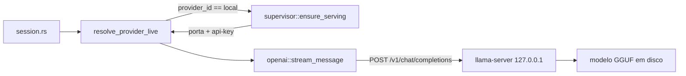

# Local models with llama.cpp — `llama-server` sidecar + Hugging Face GGUF downloader

## Context

Hoje o Claudinio Code só fala com modelos **remotos**. `AgentConfig::resolve_provider`
(`src-tauri/src/agent/provider.rs:390`) resolve todo modelo para um de dois caminhos: a API da
Claudinio (`Protocol::Anthropic`) ou um provider externo conectado via catálogo models.dev
(`Protocol::OpenAiChat`). Não existe nenhuma noção de modelo local — grep por
`ollama|llama.cpp|gguf|vllm` no repo inteiro retorna zero. A única inferência local que existe é a
de *embeddings* (`code_intel/embeddings.rs`), e ela não passa pelo sistema de providers.

Isso torna impossível usar o app sem conexão, com código que não pode sair da máquina, ou sem custo
por token. Este plano fecha essa lacuna: roda **llama.cpp nativamente** (o `llama-server` oficial de
`ggml-org/llama.cpp`) e dá ao usuário um jeito de **baixar modelos GGUF do Hugging Face** de dentro
do app, com progresso, verificação de integridade e recomendação por RAM.

### Decisões confirmadas com o usuário

| Decisão | Escolha |
| --- | --- |
| Plataformas | Todas as 6 do `release.yml`: macOS arm64 (Metal), Windows x64 (Vulkan + CPU), Linux x64 (Vulkan + CPU), Windows arm64, Linux arm64 |
| Descoberta de modelos | Lista curada no repo **+** busca livre na API do Hugging Face |
| Protocolo app ↔ llama-server | `/v1/chat/completions` — reusa `provider/openai.rs` inteiro |

### Estratégia: sidecar gerenciado, não bindings in-process

Usamos o binário `llama-server` dos releases oficiais, baixado sob demanda e pinado por
versão + sha256 — exatamente o arranjo que o Chrome for Testing já tem em
`src-tauri/src/browser/provision.rs`. Bindings in-process (`llama-cpp-2`) foram descartados: exigiriam
toolchain C++/CMake nos 6 alvos do CI, quebrariam o cross-compile de windows-arm64, e o backend de
GPU viraria decisão de *build time* — multiplicando a matriz de release.

O ganho é que quase nada de novo precisa existir no caminho quente: `llama-server --jinja` expõe
`/v1/chat/completions` com streaming e tool calling, que é precisamente a superfície que
`agent/provider/openai.rs` já fala em produção com o OpenRouter.



---

## Low-Level Design

### Layout

```
src-tauri/src/llama/                 # NOVO módulo core (irmão de browser/)
  mod.rs                             # LocalPrefs, LocalStatus, LOCAL_PROVIDER_ID, status()
  provision.rs                       # sidecar: pin → download → extract → ready marker
  llama_pins.rs                      # GERADO por scripts/pin_llama.py
  supervisor.rs                      # registro de processos, portas, api-key, /health, shutdown
  curated.rs                         # lista curada de modelos GGUF (estática)
  hf.rs                              # cliente da API do Hugging Face
  catalog.rs                         # catálogo de GGUF em disco (manifest, install/remove)
  hardware.rs                        # detecção de RAM/VRAM + recomendação de quantização
src-tauri/src/commands/local_llm.rs  # NOVA superfície IPC
scripts/pin_llama.py                 # NOVO, espelha scripts/pin_chromium.py
src/components/settings/SettingsLocalModels.tsx   # NOVA aba de settings
```

`llama/` é **core**: o teste de arquitetura em `src-tauri/src/lib.rs:137` proíbe `crate::commands`
dentro de dirs core — adicione `"src/llama"` à lista em `lib.rs:139-145`.

Dependências novas no `src-tauri/Cargo.toml` (ao lado do `zip`, ~linha 165):

```toml
# Os assets de release do llama.cpp são .tar.gz em macOS/Linux. Rust puro pelo
# mesmo motivo do `zip`: depender de um `tar` no PATH não é portável no Windows.
tar = "0.4"
flate2 = { version = "1", default-features = false, features = ["rust_backend"] }
```

`rust_backend` (miniz_oxide) evita um zlib em C — mesma restrição de CRT no Windows que já forçou
`default-features = false` no `tokenizers` (`Cargo.toml:151-155`).

---

### 1. Provisionamento do `llama-server` — `llama/provision.rs`

Transposição direta de `browser/provision.rs`.

```rust
pub struct LlamaAsset { pub target: &'static str, pub archive: Archive,
                        pub sha256: &'static str, pub size: u64 }
pub enum Archive { TarGz, Zip }
pub enum Backend { Auto, Cpu, Vulkan }

include!("llama_pins.rs");   // LLAMA_BUILD: &str, LLAMA_ASSETS: &[LlamaAsset]

const BASE_URL: &str = "https://github.com/ggml-org/llama.cpp/releases/download";
const READY_MARKER: &str = ".ready";

pub fn host_targets(backend: Backend) -> &'static [&'static str];  // preferido → fallback
pub fn asset_for(target: &str) -> Option<&'static LlamaAsset>;
pub fn artifact_url(build: &str, target: &str) -> String;
pub fn llama_dir() -> Result<PathBuf, String>;     // data_dir()/claudinio-code/llama
pub fn install_dir() -> Result<PathBuf, String>;   // llama_dir()/<build>-<target>
pub fn managed_exe() -> Result<PathBuf, String>;   // install_dir()/llama-server[.exe]
pub fn is_installed() -> bool;
pub async fn ensure_installed(backend: Backend, on_progress: Option<&ProgressFn>) -> Result<PathBuf, String>;
pub fn uninstall() -> Result<(), String>;
pub fn gc_stale_installs();
pub fn detect_system_llama_server() -> Option<PathBuf>;
fn extract_tar_gz(archive: &Path, dest: &Path) -> Result<(), String>;
fn strip_single_root(rel: &Path) -> PathBuf;
```

**Seleção de asset** (verificado no `release.yml` do llama.cpp):

| host | Backend | targets |
| --- | --- | --- |
| macos/aarch64 | — | `macos-arm64` (Metal embutido) |
| macos/x86_64 | — | `macos-x64` |
| linux/x86_64 | Vulkan / Cpu | `ubuntu-vulkan-x64` → `ubuntu-x64` |
| linux/aarch64 | Vulkan / Cpu | `ubuntu-vulkan-arm64` → `ubuntu-arm64` |
| windows/x86_64 | Vulkan / Cpu | `win-vulkan-x64` → `win-cpu-x64` |
| windows/aarch64 | — | `win-cpu-arm64` |

`Backend::Auto` só escolhe Vulkan quando o loader existe (`vulkan-1.dll` no PATH/System32; ou
`libvulkan.so.1` em `/usr/lib/**`). **CUDA fica fora do v1** por decisão explícita: o zip CUDA exige
um segundo `cudart-*.zip` (~390 MB) descompactado no mesmo dir, dobrando a tabela de pins e a
superfície de falha; Vulkan cobre NVIDIA no Windows. Registrar isso no doc do módulo.

**Extração achata a raiz do archive.** Os tarballs de macOS/Linux vêm com um único diretório
`llama-b10502/` (`tar --transform "s,^\.,llama-<tag>,"`), e os zips do Windows vêm planos. `strip_single_root`
remove o primeiro componente quando *todas* as entradas o compartilham. Isso é load-bearing: o binário
resolve `libllama.dylib` via `@loader_path` e `libggml*.so` via `$ORIGIN`, então as libs precisam ficar
ao lado do exe — e um segmento a menos de path ajuda no MAX_PATH (mesmo raciocínio de
`browser/provision.rs:71-79`). Ambos os extratores mantêm a guarda anti zip-slip de
`browser/provision.rs:187-198` (`enclosed_name()` + `starts_with(dest)`); `tar-rs` escreve `../` sem
reclamar, então a checagem é manual. Extração em `tokio::task::spawn_blocking`.

`install_dir` é `llama/<build>-<target>` (ex.: `b10502-macos-arm64`) — versionado *e* por backend, então
bump de pin ou troca de backend é um dir novo, nunca um meio-sobrescrito. `gc_stale_installs()` roda no
startup e apaga dirs cujo `.ready` não bate com `LLAMA_BUILD`, senão cada bump vaza ~34 MB.

**`scripts/pin_llama.py`** — stdlib-only, estruturado como `scripts/pin_chromium.py`:
resolve a tag via `GET https://api.github.com/repos/ggml-org/llama.cpp/releases/latest` (ou
`/releases/tags/<tag>`), acha cada asset por nome, faz stream + `hashlib.sha256` sem gravar em disco, e
imprime o literal Rust de `LLAMA_BUILD` + `LLAMA_ASSETS`. A API de Releases do GitHub **não** publica
checksum — é exatamente por isso que o script existe (mesma justificativa de `browser/provision.rs:9-11`).

**`detect_system_llama_server()`** — na ordem: `$CLAUDINIO_LLAMA_SERVER`, varredura do PATH,
`/opt/homebrew/bin`, `/usr/local/bin`, `/usr/bin`, `%LOCALAPPDATA%\Programs\llama.cpp`. Exposto em
`LocalStatus.system_server` e selecionável por `LocalPrefs.server_path`, espelhando
`BrowserPrefs::resolve_exe` (`browser/mod.rs:77-89`) — é também a saída de emergência quando um
antivírus come o binário baixado.

---

### 2. Supervisor de processo — `llama/supervisor.rs`

Precisa ser um **singleton global** (`static REGISTRY: OnceLock<Mutex<HashMap<String, Arc<Instance>>>>`),
não um campo de `AppState`: `provider::stream_message` recebe apenas `&AgentConfig`, sem acesso ao
state do Tauri. Mesmo padrão do app handle estático em `net_activity.rs`.

```rust
pub struct Endpoint { pub base_url: String, pub api_key: String, pub model_key: String }

pub async fn ensure_serving(model_key: &str, prefs: &LocalPrefs) -> Result<Endpoint, String>;
pub async fn stop(model_key: &str);
pub async fn stop_all();                 // no RunEvent::Exit
pub fn running() -> Vec<RunningModel>;
pub fn stderr_tail(model_key: &str) -> Vec<String>;
fn reserve_port() -> Result<u16, String>;
fn build_args(spec: &StartSpec) -> Vec<String>;   // puro → testável
```

**Argv:**

```
llama-server --host 127.0.0.1 --port <reservada>
  -m <gguf>            # primeiro shard, em modelo dividido
  -a <model_key>       # id em /v1/models == rp.model, senão 404
  --api-key <aleatória> --jinja --no-webui
  -c <ctx> -ngl <auto|0> -np <parallel>
  --sleep-idle-seconds 300
```

- **Portas**: `TcpListener::bind(("127.0.0.1", 0))` → lê `local_addr().port()` → solta o listener
  (mesmo truque de `commands/providers.rs:42-49`, só que liberando). A janela de TOCTOU é fechada por
  retry: se o filho morre durante a espera de health e o stderr casa `Address already in use`,
  `ensure_serving` tenta outra porta (até 3x).
- **api-key aleatória por processo**, nunca persistida nem logada. Sem ela, qualquer processo local — e
  qualquer página que o Chromium do agente visitar — pode `fetch("http://127.0.0.1:PORT/v1/chat/completions")`
  e ganhar um endpoint de inferência grátis, além de um oráculo de prompt injection. `random_hex` hoje mora
  em `commands/auth.rs:40-53`; promover para um `crate::randutil` e re-exportar de `auth.rs` (core não pode
  importar `commands`).
- **Health**: poll de `GET /health` a cada 250 ms com `Authorization: Bearer`. `200` pronto, `503` carregando,
  connection-refused continua esperando a menos que `child.try_wait()` diga que morreu. Deadline **derivado do
  tamanho** — `30s + file_bytes / 50MB/s`, teto de 10 min: um GGUF de 20 GB em cache frio leva minutos, e o
  timeout fixo de 20 s de `browser/launch.rs:9` reprovaria todo modelo grande.
- **stderr**: `Stdio::piped()` + task lendo para um `VecDeque` de 200 linhas com a api-key redigida. É o
  único canal de diagnóstico para "sem GPU", "GGUF version não suportada", "failed to allocate buffer";
  anexado a toda falha de start, como em `browser/launch.rs:152-165`.
- **Quantos modelos ao mesmo tempo**: `LocalPrefs.max_loaded_models`, default **1**, clamp 1..=2 (Brain e
  Builder podem ambos ser locais, mas um par 7B já é ~9 GB). Estourou → evict LRU. Por cima, guarda de RAM:
  recusa iniciar se `residentes + novo > 0.75 * total_ram`, com erro nomeando o modelo a descarregar. É essa
  checagem que troca "desktop congelado em swap" por uma mensagem de erro.
- **`--sleep-idle-seconds 300`** é o que torna barato manter o processo vivo: porta e processo ficam, os pesos
  saem da RAM, e o próximo request paga um reload em vez de um cold start.
- **Shutdown**: `kill_on_drop(true)` cobre pânico, não a saída do app (`Drop` de static não roda). Trocar
  `lib.rs:122` de `.run(generate_context!())` para `.build(...)?.run(|_app, event| { if matches!(event, RunEvent::Exit | RunEvent::ExitRequested{..}) { block_on(supervisor::stop_all()) } })`.
  `stop()` espelha `browser/launch.rs:220-240` (`start_kill()` → 3 s → `taskkill /T /F` no Windows). Cada
  instância grava um PID file e `ensure_serving` reapa órfãos de um crash anterior com a guarda
  PID-*mais*-exe-match de `browser/launch.rs:187-213` — reuso de PID torna `kill(pid)` cru problema de
  terceiros.

---

### 3. Registro do modelo local no sistema de providers

Provider id `"local"`; ids de modelo são `local/<model_key>` e passam por
`AgentConfig::resolve_provider` (`agent/provider.rs:390-417`) **sem alteração** — o split no primeiro `/`
já faz a coisa certa.

**Desvio do plano (adotado na implementação):** em vez de escrever um `ProviderEntry` sintético em
`config.providers`, `resolve_provider` trata o prefixo `local/` nativamente, num branch antes do lookup
de providers. Motivo: um `ProviderEntry` seria uma **segunda cópia** da lista de modelos, que sai de
sincronia com o que está em disco no instante em que um download falha pela metade ou o usuário apaga um
modelo. O branch nativo também torna impossível um provider externo chamado "local" sombrear a inferência
local (coberto por teste). `pricing: Some((0.0, 0.0))` faz a contabilidade existente reportar zero em vez
de `undefined`; `max_output_tokens` é preenchido em `resolve_provider_live` a partir do `context_length`
do catálogo (`(ctx/2).clamp(512, 8192)`), senão um modelo de 4k contexto toma 400 com `max_tokens: 32000`.
Como "local" nunca entra em `config.providers`, `disconnect_provider` e `list_provider_models` não precisam
de guarda; só `list_all_models` ganha o grupo, montado a partir do catálogo em disco.

**Ponto de inserção — o núcleo do plano.** `resolve_provider` é síncrono e não sabe de portas. Adicionar um
wrapper async logo depois dele (`agent/provider.rs`, após a linha 417):

```rust
/// `resolve_provider`, mais o efeito colateral que um modelo local exige: o
/// sidecar precisa estar no ar antes do request, e porta e api-key são por
/// processo — sobrescrevem os placeholders guardados no config.json.
pub async fn resolve_provider_live(config: &AgentConfig, model: &str)
    -> Result<ResolvedProvider, String>
{
    let mut rp = config.resolve_provider(model);
    if rp.provider_id == crate::llama::LOCAL_PROVIDER_ID {
        let ep = crate::llama::supervisor::ensure_serving(&rp.model, &config.local).await?;
        rp.base_url = ep.base_url;
        rp.api_key  = ep.api_key;
    }
    Ok(rp)
}
```

E trocar exatamente **três linhas** — os três entrypoints de LLM:

| local | de | para |
| --- | --- | --- |
| `agent/provider.rs:~849` (`classify_turn_completion`) | `let rp = config.resolve_provider(model);` | `let rp = resolve_provider_live(config, model).await?;` |
| `agent/provider.rs:~937` (`one_shot`) | idem | idem |
| `agent/provider.rs:~1044` (`stream_message`) | idem | idem |

Tudo a jusante — `openai::stream_message`, tradução de tools, parsing de SSE, o header `Authorization: Bearer`
em `openai.rs:634` — funciona sem modificação.

`AgentConfig` ganha `#[serde(default)] pub local: LocalPrefs` ao lado de `browser`.
Em `commands/providers.rs`: `disconnect_provider` (~:295) rejeita o id `local`; `list_provider_models` (~:316)
ganha um branch inicial devolvendo as chaves do catálogo; `list_all_models` (:353) então já o inclui — só
ajustar a ordenação em ~:370 para `local` vir logo após `openrouter`.

---

### 4. Catálogo curado + busca no Hugging Face

**`llama/curated.rs`** — lista estática, só metadados (nada de hash: os hashes vêm ao vivo da API do HF):

```rust
pub struct CuratedModel {
    pub repo: &'static str,          // ex. "bartowski/Qwen2.5-Coder-7B-Instruct-GGUF"
    pub display_name: &'static str,
    pub preferred_quant: &'static str,   // "Q4_K_M"
    pub min_ram_gb: u32,
    pub blurb: &'static str,
    pub tool_calling: bool,          // validado à mão no loop de tools do agente
}
pub const CURATED: &[CuratedModel];
pub fn for_hardware(hw: &HardwareProfile) -> Vec<&'static CuratedModel>;  // ordenado por caber
```

Cobrir a faixa 3B→32B com modelos que sabem tool calling (família Qwen-Coder, gpt-oss, Devstral). Cada repo
deve ser **verificado ao vivo** na implementação (existe? tem `chat_template` no bloco `gguf`?) — não commitar
repo inventado. A lista é ordenada por hardware, com os que não cabem exibidos desabilitados em vez de ocultos.

**`llama/hf.rs`**

```rust
pub async fn search(query: &str, limit: usize) -> Result<Vec<HfModelSummary>, String>;
pub async fn repo_detail(repo: &str) -> Result<HfRepoDetail, String>;
pub fn group_quants(files: &[HfTreeFile]) -> Vec<QuantOption>;   // puro
pub fn parse_shard(path: &str) -> Option<(u32, u32)>;            // puro
pub fn resolve_url(repo: &str, path: &str) -> String;
```

- Busca: `GET /api/models?filter=gguf&search={q}&sort=downloads&direction=-1&limit={n}`.
- Detalhe: `GET /api/models/{repo}` (bloco `gguf`: `context_length`, `chat_template`, `architecture`, `total`)
  **e** `GET /api/models/{repo}/tree/main?recursive=true` (`path`, `size`, `lfs.oid`).
- **`lfs.oid` é o sha256 real do objeto** — verificado ao vivo contra `unsloth/Qwen3-8B-GGUF`. Ou seja, o
  download ganha verificação de integridade genuína sem script de pin e sem problema de staleness.
- Tudo sob `NetGuard::begin(NetSource::HuggingFaceApi, …)` e `crate::http::default_client()`.

`group_quants` agrupa por token de quantização em `…-<QUANT>[-000NN-of-000MM].gguf`, ordena shards por índice
e **descarta conjuntos incompletos** (`shards.len() != of`).

**`llama/catalog.rs`** — layout em disco:

```
data_dir()/claudinio-code/models/gguf/
  catalog.json
  <key>/            # key = xxh3_64 hex de "<repo>/<filename>" (16 chars)
    model.json
    <original>.gguf
```

Dirs curtos e hasheados, não `bartowski__Qwen2.5-Coder-32B-Instruct-GGUF/`, pelo motivo de MAX_PATH registrado
em `browser/provision.rs:71-79`; `xxhash-rust` já é dependência e já é usado assim em `commands/code_intel.rs`.

`install()` itera os shards chamando
`download_verified_with_retries(url, dest, label, &f.sha256, f.size, NetSource::LocalModelDownload, Some(&progress), DEFAULT_RETRIES)`.
**`download.rs` não muda**: o staging em `.part`, o sha256 incremental e o rename atômico
(`download.rs:57-84`) já dão a garantia por shard. A entrada no catálogo é o próprio ready marker — um crash no
meio deixa um modelo que `is_complete()` rejeita e `install()` retoma, pulando shards já verificados por
existência + tamanho (mesmo idiom de `embeddings.rs:835-838`).

**Cancelar um download de 20 GB**: não threadar um flag de cancelamento por `download.rs` (3 call sites, um deles
o caminho de embeddings). Em vez disso, em `commands/local_llm.rs`, `tokio::select!` entre `install()` e um
`Notify` por chave (guardado no `AppState` ao lado de `oauth_cancel`, `state.rs:131`). Dropar a future de download
aborta o `bytes_stream()` no meio, o que é seguro justamente porque o destino é um `.part` que nunca foi renomeado;
depois apagam-se os `.part`. **Não há resume no v1** — dizer isso na UI ("cancelar descarta o que já baixou");
shards completos *são* preservados.

**Progresso**: evento `local-model-download-progress`, mesmo padrão de `commands/browser.rs:32-42`, com
`{key, fileIndex, fileCount, downloadedBytes, totalBytes, overallDone, overallTotal, phase}`. Os campos
`overall*` importam aqui de um jeito que não importavam no Chromium: um modelo de 3 shards com barra que zera
duas vezes lê como download travado.

`remove(key)` chama `supervisor::stop(key)` antes — no Windows o `.gguf` está mmapped e não pode ser apagado com
o servidor no ar (mesmo risco já tratado em `commands/browser.rs:56-58`).

---

### 5. Hardware e recomendação de quantização — `llama/hardware.rs`

```rust
pub fn detect() -> HardwareProfile;                      // sysinfo, como commands/system_stats.rs:22-25
pub fn usable_model_bytes(hw: &HardwareProfile) -> u64;  // max(0.70*RAM, VRAM), menos 4 GB de folga
pub fn recommend_quant<'a>(budget: u64, opts: &'a [QuantOption]) -> Option<&'a QuantOption>;  // puro
pub fn fit_verdict(total_bytes: u64, hw: &HardwareProfile) -> Fit;  // Comfortable | Tight | WontFit
```

VRAM é best-effort e nunca bloqueante: macOS arm64 → `unified_memory = true`; senão tenta
`nvidia-smi --query-gpu=name,memory.total --format=csv,noheader,nounits` com `procutil::no_window` e timeout de
2 s; qualquer outro caso → `None` e `-ngl auto` decide. `recommend_quant` ordena por qualidade
(`Q8_0 > Q6_K > Q5_K_M > Q4_K_M > Q4_K_S > IQ4_XS > IQ3_M > Q3_K_M`) e devolve a melhor que cabe somando
uma sobrecarga grosseira de KV cache. `fit_verdict` dirige o badge: verde <60% do orçamento, âmbar até 100%,
vermelho acima — e o vermelho **bloqueia** o botão de download (com override confirmado), não só avisa.

---

### 6. Comandos Tauri, IPC e UI

`src-tauri/src/commands/local_llm.rs`:

```rust
local_status() -> LocalStatus
local_install_server(app) / local_uninstall_server()
local_hardware() -> HardwareProfile
local_curated_models() -> Vec<CuratedView>
local_search_models(query, limit) / local_repo_quants(repo) -> RepoQuants
local_install_model(app, state, repo, quant) / local_cancel_install(state, key)
local_list_models() -> Vec<LocalModelView> / local_remove_model(state, key)
local_test_model(state, key) -> String     // contraparte de browser_test
local_unload_model(key) / local_server_logs(key) -> Vec<String>
```

`local_test_model` é o botão que transforma "o modelo não faz nada" em mensagem diagnosticável:
`ensure_serving` → um `openai::complete` não-streaming ("reply with OK") → latência e endpoint, ou falha com o
stderr tail anexado. Registrar tudo em `lib.rs` após `commands::browser::browser_test` (`lib.rs:112`) e
`pub mod local_llm;` em `commands/mod.rs`. `net_activity.rs` ganha `LlamaServerDownload`,
`LocalModelDownload` e `HuggingFaceApi` no enum (:30) e em `source_to_str` (:46).

`src/lib/ipc.ts` — novo bloco após o de Browser (:578-620) com os tipos `LocalPrefs`, `LocalStatus`,
`HardwareProfile`, `HfModelSummary`, `QuantOption`, `RepoQuants`, `LocalModel`, `LocalModelView`,
`ModelDownloadProgress` e os wrappers `invoke`. Adicionar `local?: LocalPrefs` às duas interfaces
`AgentConfig` (`:115` e `:151`), ao lado de `browser?`.

`src/components/SettingsPanel.tsx`: novo `CategoryId` `'local'` (:84), linha em `CATEGORIES` (:92-101) com
ícone `cpu` e `searchTerms` `["Local models","llama.cpp","GGUF","Hugging Face","Quantization","Offline","VRAM"]`,
entrada em `getCategoryLabel` (:104-114) e o bloco de render ao lado de `SettingsBrowser` (:349).

`src/components/settings/SettingsLocalModels.tsx` — estruturado como `SettingsBrowser.tsx` (`createResource` +
`listen(...)` em `onMount` com `onCleanup(unlisten)`, :34-42), em três seções: **Runtime** (build do
llama-server, install/remove, seletor de backend, linha de hardware detectado); **Modelos instalados** (tamanho,
contexto, badge running/idle, Test, Unload, Remove, disco total); **Adicionar** (abas *Recomendados* — a lista
curada filtrada por hardware — e *Buscar no Hugging Face*, ambas levando à tabela de quantizações com badge de
fit e a recomendada pré-selecionada, e daí ao download com barra em dois níveis + Cancel).

`SettingsModels.tsx` **não muda**: ids `local/<key>` chegam por `list_all_models` e os pickers de Brain/Builder
já os renderizam.

### O que NÃO muda

`download.rs`, `http.rs`, `agent/provider/openai.rs`, `agent/session.rs`, `SettingsModels.tsx`, `ModelSelect.tsx`,
e a assinatura de `resolve_provider`.

---

## Riscos

| Risco | Tratamento |
| --- | --- |
| Modelo maior que a RAM | Três portões: `fit_verdict` bloqueia o download, a guarda de 0.75×RAM recusa o start, e o deadline de health derivado do tamanho evita falso timeout. Sem isso o modo de falha é desktop congelado, não diálogo de erro. |
| Antivírus / SmartScreen no Windows | `llama-server.exe` não assinado, baixado em runtime e abrindo porta é falso-positivo clássico. Reportar o erro real do SO no spawn (`ERROR_VIRUS_INFECTED` = 225 com mensagem própria), `is_installed()` detecta exe em quarentena, e `detect_system_llama_server()` é a saída. Documentar exclusão de `%LOCALAPPDATA%\claudinio-code\llama`. |
| Vulkan ausente / GPU quebrada | `Backend::Auto` sonda o loader antes de escolher o asset; se o driver quebrar depois, o stderr tail nomeia a lib faltante e o seletor de backend permite cair para `cpu` sem rebaixar o modelo. |
| Cancelar 20 GB | `tokio::select!` + `Notify` por chave; sobram só `.part`, que são apagados. Sem resume no v1 — dito na UI. |
| Sem `chat_template` no GGUF | `--jinja` fica sem template e o tool calling degrada silenciosamente para prosa. Sinalizar na tabela de quantizações e recusar esse modelo como Builder. |
| Exposição em loopback | `--host 127.0.0.1` + `--api-key` + `--no-webui`, com teste unitário sobre `build_args`. |
| Bump de pin | `gc_stale_installs()` evita vazar dirs; `local_test_model` é o check pós-bump (um llama-server rebaixado rejeita GGUF mais novo). |
| `-np` vs. subagentes paralelos | Até 8 subagentes contra `-np 1` serializam. Default `min(4, max_parallel_agents)` quando a RAM permite; cada slot custa seu próprio KV cache. |

## Non-goals (v1)

CUDA/ROCm/SYCL; resume de download; token do HF para repos gated (detectar e recusar com mensagem clara);
multimodal/mmproj; embeddings servidos pelo llama-server (o caminho ONNX/candle continua como está);
quantização local de modelos.

---

## Tasks Summary

1. `scripts/pin_llama.py` + `llama_pins.rs` + `provision.rs` (+ deps `tar`/`flate2`) + testes. Autocontido, sem UI.
2. `supervisor.rs`, mudança de `RunEvent::Exit` em `lib.rs`, promoção de `random_hex` para fora de `commands/auth.rs`.
3. `hardware.rs`, `hf.rs`, `curated.rs`, `catalog.rs` — lógica pura + um caminho de rede, testável offline.
4. `commands/local_llm.rs`, registro em `lib.rs`, variantes de `NetSource`, `"src/llama"` no teste de arquitetura.
5. `resolve_provider_live` + as três trocas de uma linha em `agent/provider.rs`, mais os branches em `commands/providers.rs`.
6. Tipos em `ipc.ts`, `SettingsLocalModels.tsx`, wiring em `SettingsPanel.tsx`.
7. Plano em `docs/plans/2026-08-19_local-models-llama-cpp.md`, seção no `README.md` + `README.pt-BR.md`, nota em `docs/ARCHITECTURE.md` (novo limite de confiança: processo local com porta e chave).

Passos 1-4 não tocam o caminho quente do agente; a mudança arriscada (passo 5) chega por último e tem três linhas de largura.

---

## Verification

**Testes automatizados** (todos offline, `clippy -D warnings`-clean):

- `provision.rs`: pins com sha256 de 64 hex e `size > 5_000_000`; `host_targets` só devolve targets existentes em `LLAMA_ASSETS`; `artifact_url` bate com a URL real de release; `strip_single_root` achata `llama-b10502/…` e deixa listagem plana intacta; leaf de `install_dir` sem separador e ≤32 chars (guarda MAX_PATH); `.tar.gz` construído em memória com entrada `../evil` é rejeitado e nada é escrito fora do `tempdir`.
- `hf.rs`: `parse_shard` aceita `-00002-of-00003.gguf` e rejeita `-1-of-3.gguf`; `group_quants` agrupa e ordena shards fora de ordem e descarta conjunto incompleto; round-trip serde de uma entrada de tree literal capturada da API viva, provando que `lfs.oid` desserializa como sha256.
- `hardware.rs`: `recommend_quant` devolve `Q4_K_M` com 8 GB e `Q8_0` com 64 GB; loop de 1..64 GB assertando que nunca devolve algo acima do orçamento.
- `supervisor.rs`: `build_args` contém `--jinja`, `--api-key`, `--no-webui`, `--host 127.0.0.1` e **não** contém `--host 0.0.0.0`; `stderr_tail` redige a api-key; `reserve_port` devolve porta que pode ser rebindada.
- `agent/provider.rs` (no `mod tests` existente): `local/abc123` resolve para `Protocol::OpenAiChat`, `provider_id == "local"`, `model == "abc123"`, pricing `(0.0, 0.0)`.
- `catalog.rs`: round-trip JSON de `LocalModel`; `model_key` estável e escopado por repo; `is_complete` rejeita shard faltando.
- Frontend: `SettingsLocalModels.test.tsx` — barra lê percentual *overall* num payload de 3 shards; Cancel chama `localCancelInstall`.

**Verificação end-to-end** (manual, `pnpm tauri dev`):

1. Settings → Local models → **Install runtime**: barra progride, `.ready` gravado, `local_status` reporta o build e o exe.
2. **Recomendados**: a lista curada mostra fit por hardware; escolher um 7B → tabela de quantizações com a recomendada pré-selecionada → Download com progresso em dois níveis; matar o app no meio e reabrir → o modelo aparece incompleto e o download retoma pulando shards prontos.
3. **Test** no modelo instalado: retorna latência e endpoint. Desligar o Wi-Fi e repetir — deve continuar funcionando (é o teste que prova o modo offline).
4. Selecionar `local/<modelo>` como **Builder** em Settings → Models e mandar uma tarefa real que exija tool calling (ler um arquivo e editá-lo): confirmar `ToolCall`/`ToolResult` no chat e custo **zero** no rodapé.
5. Verificar isolamento: `curl http://127.0.0.1:<porta>/v1/models` sem header deve dar 401.
6. Fechar o app e conferir que nenhum `llama-server` sobrou (`ps` / Gerenciador de Tarefas).
7. Remover o modelo com o servidor no ar → deve parar o processo e apagar sem erro (crítico no Windows por causa do mmap).

**Checks de PR** (`CONTRIBUTING.md`): `pnpm test`, `pnpm exec tsc --noEmit`, e de `src-tauri/`: `cargo fmt --all --check`, `cargo clippy --all-targets -- -D warnings`, `cargo test`. Rodar também `cargo check --no-default-features --features embeddings-candle`, já que o job baseline do release compila essa variante e uma dep nova pode quebrar só lá.


---

## Implementation Log — 2026-08-19

**Resumo:** implementado e verificado end-to-end. `llama-server` b10502 provisionado, modelo GGUF baixado
do Hugging Face com verificação sha256 upstream, servidor iniciado em porta de loopback com api-key
aleatória, e **tool calling confirmado funcionando** (`finish_reason: tool_calls`) numa chamada real.

**Arquivos novos:** `src-tauri/src/llama/{mod,provision,supervisor,catalog,curated,hardware,hf,llama_pins}.rs`,
`src-tauri/src/commands/local_llm.rs`, `src-tauri/src/randutil.rs`, `src-tauri/examples/llama_check.rs`,
`scripts/pin_llama.py`, `src/components/settings/SettingsLocalModels.tsx` (+ `.test.tsx`).

**Modificados:** `Cargo.toml` (tar, flate2), `lib.rs` (módulo, comandos, `RunEvent::Exit`, gc no setup,
teste de arquitetura), `net_activity.rs` (3 variantes), `agent/provider.rs` (branch local,
`resolve_provider_live`, 3 call sites), `commands/agent.rs` (get/set_config), `commands/providers.rs`
(grupo local), `commands/auth.rs` (`random_hex` promovido), `state.rs` (`local_downloads`),
`src/lib/ipc.ts`, `src/components/SettingsPanel.tsx`, `README.md`, `README.pt-BR.md`,
`docs/ARCHITECTURE.md`.

**Journal:**

1. **Layout dos archives** — os tarballs de macOS/Linux embrulham tudo em `llama-bNNNNN/`, os zips do
   Windows são planos. O achatamento (`common_root`) falhou na primeira execução real porque o tar também
   carrega uma entrada para o *próprio diretório raiz* (`llama-b10502/`), sem segundo componente — o que
   fazia a função desistir e deixava o binário um nível fundo demais. Corrigido, com o formato real
   coberto por teste, incluindo o prefixo `./` que o tar emite.

2. **Bug de segurança encontrado por teste** — a primeira versão de `common_root` tratava `..` como raiz
   comum, então `../evil` era despido para `evil` *antes* da checagem de traversal e escrevia dentro do
   destino. Agora a validação roda no nome cru, antes de qualquer strip, e há teste com um header de tar
   forjado byte a byte (o `tar::Builder` recusa construir a entrada maliciosa pela via normal).

3. **`--api-key` verificado, não presumido** — `/v1/chat/completions` responde **401** sem a chave
   (confirmado contra b10502). `/health` e `/v1/models` ficam abertos por design do llama-server; isso é
   aceitável porque não expõem compute nem dado sensível — e é a razão de o alias do modelo ser um hash
   opaco, não um caminho. O exemplo `llama_check` verifica isso a cada execução.

4. **KV cache subdimensionado** — a estimativa original tinha uma divisão a mais e reservava ~4 MB para
   32k de contexto. Ajustada para 64 KB/token (~2 GB em 32k), que é a ordem certa para um 7-14B.

5. **Deadline de health derivado do tamanho** — um timeout fixo reprovaria todo modelo grande. Medido:
   0.6B carrega em 14s em cache frio e 1.0s em cache quente.

6. **Repos curados verificados ao vivo** — os 8 repos da lista foram consultados na API do HF: nenhum é
   gated e todos publicam `chat_template` no bloco `gguf`. Sem isso `--jinja` não tem o que executar e o
   tool calling degrada silenciosamente para prosa.

**Verificação:** `cargo fmt --all --check`, `cargo clippy --all-targets -- -D warnings`, `cargo test`
(642 passando), `cargo check --no-default-features --features embeddings-candle`, `pnpm test`
(717 passando, 45 arquivos), `pnpm exec tsc --noEmit` — todos verdes. Mais o `cargo run --example
llama_check`, que exercita download → extração → start → 401 sem auth → tool call → shutdown → remoção.

**Aberto:** sem resume byte a byte de um único arquivo (só por shard); CUDA/ROCm fora do v1; token do HF
para repos gated não implementado (detectado e recusado com mensagem).


## Implementation Log — 2026-08-20 (correções de uso)

Três problemas que só apareceram com o usuário usando a feature de verdade:

7. **O modelo não aparecia no picker.** Duas causas somadas: a lista de modelos só é buscada quando o
   painel de Settings *abre* (`App.tsx:350`), então baixar um modelo com o painel já aberto não a
   atualizava; e o grupo local é gated por `local.enabled`, cujo default é `false`. Agora
   `SettingsLocalModels` recebe `onChanged` (ligado ao `refreshProviders` que já existia) e o dispara ao
   instalar, remover e ao ligar/desligar o switch. Além disso, a aba mostra um aviso explícito quando há
   modelos completos em disco e o switch está desligado — o beco sem saída exato em que o usuário caiu.

8. **O picker mostrava `local/b55d3d9e4269fdb3`.** Erro de design meu: usei o hash do diretório (escolhido
   por MAX_PATH) também como id visível, e `ModelGroup` só carregava ids. `ModelGroup` ganhou
   `labels: HashMap<String,String>` (aditivo, `skip_serializing_if` vazio), preenchido só pelo grupo local;
   `ModelSelect` resolve o rótulo no gatilho, na lista e na busca, com fallback para o id cru quando o
   modelo não está mais listado. O badge "Experimental" deixou de aparecer no grupo local: ali significa
   "provider de terceiro via models.dev", não "pode não funcionar".

9. **Contexto servido agora segue o handoff.** Um GGUF anunciando 262144 fazia o servidor alocar KV cache
   para tokens que a sessão nunca alcança (ela faz handoff entre 120k e 256k). `llama::effective_ctx`
   deriva o `-c` de `effective_handoff_threshold() + 8192` de folga para a resposta, limitado pelo que o
   modelo suporta; um `ctxSize` explícito continua sendo instrução. Como um servidor no ar não pode ser
   redimensionado, `Instance` guarda o `ctx_size` e um budget diferente força restart — senão mexer no
   slider parecia não fazer nada. `max_output_tokens` passou a sair da janela realmente servida.

**Nota de nomenclatura:** o badge "Local" ao lado de "Brain Model", "Parallel subagents" etc.
(`SettingsModels.tsx:40`) é pré-existente e significa "config da máquina, não do `.claudinio.json` do
workspace". Colide por acidente com o nome desta feature; não foi mexido.

**Verificação:** `cargo test` (649), `pnpm test` (727), `fmt`, `clippy -D warnings`, `tsc` — verdes.


## Implementation Log — 2026-08-20 (MLX engine)

**Resumo:** segundo engine de inferência local, MLX, como sidecar próprio
(`claudin-io/claudinio-mlx`, MIT, Swift sobre `mlx-swift` + `mlx-swift-lm` da
Apple). Default no Apple Silicon; llama.cpp em todo o resto.

**Números medidos** (M2 Max, Qwen3-0.6B 4-bit, mesmo modelo nos dois):

| Engine | Geração |
| --- | --- |
| llama.cpp (`MTL,BLAS`) | 277,5 tok/s |
| MLX | 352,9 tok/s |

~27%, dentro da faixa esperada — não ordem de grandeza. O ganho grande continua
sendo trocar um modelo denso por um MoE.

**Diagnóstico de performance que motivou tudo:** o llama.cpp **já** usava Metal
com todas as 132 camadas na GPU. Os 11-14 tok/s do Qwen3.8-27B são o teto de um
27B denso nessa máquina (RSS 19,4 GB: 11,2 de pesos + ~8 de KV cache a 128k).
O 1,4 tok/s do primeiro teste foi teste mal feito — servidor rodando fora do
diretório do binário, onde o ggml não carrega o backend Metal. O app já fazia
isso certo (`cmd.current_dir(exe.parent())`).

**Por que sidecar próprio e não `mlx_lm.server`:** o oficial é Python (mais um
runtime para provisionar), **não tem opção de api-key** — a doc dele diz "not
recommended for production, only basic security checks" —, e usaria seu próprio
downloader. O nosso é binário único, exige `--api-key`, e carrega pesos de um
diretório que o Rust já verificou contra o sha256 do Hub. Tool calling **não**
foi reimplementado: vem dos parsers por família do `mlx-swift-lm` (Qwen35,
Llama3, Mistral, GLM4, KimiK2, Gemma, Harmony), que é exatamente a parte que
falha em silêncio quando reescrita.

**Journal:**

10. **Bug de encoding pego por teste real** — meu tipo `JSONValue` sombreava o
    `MLXLMCommon.JSONValue`, então `JSONSerialization.isValidJSONObject` rejeitava
    os argumentos e **toda tool call saía com `{}`**. Pareceria burrice do modelo.
    Corrigido com `JSONEncoder` (+ `withoutEscapingSlashes`) e renomeando o meu
    tipo para `AnyJSON`.

11. **`swift build` não serve** — SwiftPM CLI não compila os shaders Metal, e o
    binário resultante morre em runtime com "Failed to load the default metallib".
    É preciso `xcodebuild`, e no Xcode 26 o Metal Toolchain é componente separado
    (~690 MB). Por isso o build vive em repo próprio: o release do app não paga
    esse custo. O workflow lá faz smoke test do binário **empacotado**, porque
    essa falha só aparece ao executar.

12. **O bundle não pode se separar do binário** — `mlx-swift_Cmlx.bundle` carrega
    o `default.metallib`. `ensure_mlx_installed` verifica os dois após extrair;
    sem o bundle a falha apareceria como timeout misterioso, não arquivo ausente.

13. **Modelos MLX são outro formato** — repo inteiro, quantização no nome do repo
    (`-4bit`), e os arquivos pequenos (config, tokenizer) são blobs git **sem**
    sha256 LFS. Adicionado `download_sized`, que verifica tamanho e, para `.json`,
    que o conteúdo parseia — o que pega o caso real (truncado, ou página de erro
    HTML salva como se fosse o arquivo). Garantia mais fraca, documentada, e não
    usada para pesos.

14. **Default dependente de plataforma** — `Engine::default()` é MLX no Apple
    Silicon. Como `config.json` sincroniza entre máquinas, toda leitura passa por
    `LocalPrefs::effective_engine()`, que rebaixa para llama.cpp quando o engine
    configurado não existe ali.

**Verificação:** `cargo test` (664), `pnpm test` (733), fmt, `clippy -D warnings`,
`tsc`, `--features embeddings-candle`. Mais `cargo run --example llama_check --mlx`,
que baixa o sidecar do release (verificando sha256), instala um repo MLX, sobe o
servidor (1,5 s), confirma 401 sem chave e faz uma chamada real.

**Aberto:** o sidecar não é assinado/notarizado; o download por reqwest não põe
atributo de quarentena, então funciona, mas assinar seria o certo. Catálogo curado
ainda lista só repos GGUF — falta uma lista equivalente de `mlx-community`.
