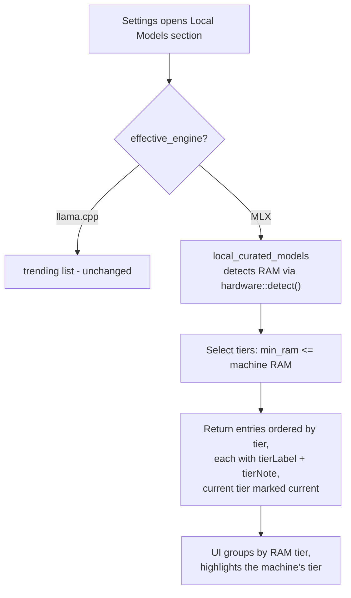

# Local Models: RAM-tier recommendations for MLX (replace trend list)

## Context

In **Settings → Local Models**, the "Suggestions" section currently shows what the Hugging Face Hub is *trending* for the selected engine (`local_curated_models` command → `hf::trending`). For MLX users this is a bad default: trending mixes models that don't fit their machine with ones they can't even run.

The user wants: detect the machine's RAM and offer a curated set of MLX models organized by RAM tier, instead of the trend list.

**Agreed decisions (interview):**
1. Replace trending **only when engine = MLX**. llama.cpp/GGUF keeps today's behavior untouched.
2. The user's model names (e.g. `Qwen3.5-4B-4bit`) are display labels; each maps to a **real, verified `mlx-community` repo** (all checked against the HF API during planning).
3. A machine shows its own tier **plus all lower tiers** (32GB sees 8/16/32), each entry labeled with its tier and note. A machine below 8 GB still gets the smallest tier rather than an empty list.

## Verified repo mapping (ground truth — all confirmed live on huggingface.co/api)

| Tier | Display label | Repo (verified) | Notes |
|---|---|---|---|
| 8GB | Qwen3.5-4B-4bit | `mlx-community/Qwen3.5-4B-MLX-4bit` (~29.8k downloads) | Small but capable |
| 8GB | Phi-4-mini-4bit | `mlx-community/Phi-4-mini-instruct-4bit` (~3.9k downloads) | Small but capable |
| 16GB | Qwen3.5-9B-4bit | `mlx-community/Qwen3.5-9B-MLX-4bit` (~27.7k downloads, 156 likes) | Great balance |
| 16GB | Gemma-3-12B-4bit | `mlx-community/gemma-3-12b-it-qat-4bit` (QAT variant: best 4-bit quality, ~27.4k downloads) | Great balance |
| 32GB | Qwen3.5-27B-4bit | `mlx-community/Qwen3.5-27B-4bit` (~7k downloads) | Strong coding + reasoning |
| 32GB | Devstral-24B-4bit | `mlx-community/Devstral-Small-2-24B-Instruct-2512-OptiQ-4bit` | Strong coding + reasoning |
| 64GB+ | Qwen3.5-122B-A10B-4bit | `mlx-community/Qwen3.5-122B-A10B-4bit` (~10k downloads) | Near-frontier quality |
| 64GB+ | Llama-4-Scout-4bit | `mlx-community/meta-llama-Llama-4-Scout-17B-16E-4bit` | Near-frontier quality |

Tier table (verbatim from the user):

```
RAM    Recommended models                              Notes
8GB    Qwen3.5-4B-4bit, Phi-4-mini-4bit                Small but capable
16GB   Qwen3.5-9B-4bit, Gemma-3-12B-4bit               Great balance
32GB   Qwen3.5-27B-4bit, Devstral-24B-4bit             Strong coding + reasoning
64GB+  Qwen3.5-122B-A10B-4bit, Llama-4-Scout           Near-frontier quality
```

## Solution Design



- **Backend**: a static RAM-tier table lives next to the existing curated GGUF table. When the effective engine is `Mlx`, `local_curated_models` returns the tier-selected entries instead of calling `hf::trending`. No network call needed — the tier list is offline-first by design (downloads/likes are not shown for these).
- **Contract**: `SuggestedModel` gains two optional fields (`ram_tier_gb`, `ram_tier_note`) plus a flag marking which tier is the machine's own, so the frontend can render groups without duplicating hardware logic.
- **Frontend**: the Suggestions block renders tier-grouped cards when the payload carries tiers (header shows e.g. "Recommended for your 32 GB Mac"); otherwise it falls back to today's trending rendering. Copy text updated accordingly.
- **Clicking a suggestion** goes through the existing flow unchanged (repo detail → quants → install), so fit-checking (`fit_verdict`) still protects oversized downloads.

## Risks

- Repos can be renamed/deleted on the Hub later; mitigation: the existing search/paste-a-URL path remains, and a failed detail lookup already surfaces an error message.
- A 64GB+ tier entry (122B MoE) is a very large download; the existing fit verdict and download-progress UI already handle confirmation and progress.
- `Phi-4-mini-instruct-4bit` is a community conversion (library_name `transformers` but tagged `mlx`); it loads under the MLX sidecar like any other tagged-mlx repo.

## Non-goals

- No change to llama.cpp/GGUF suggestions, Hub search, or paste-a-URL flows.
- No per-model benchmark numbers added to the tier cards.
- No dynamic fetching of tier contents from a remote source — the table is compiled in.
- No changes to engine selection UI or runtime installation.

## Low-Level Design

### Backend

**New file `src-tauri/src/llama/mlx_tiers.rs`** (registered in `src-tauri/src/llama/mod.rs`):

```rust
pub struct MlxTierModel {
    pub repo: &'static str,
    pub display_name: &'static str,
}
pub struct MlxTier {
    pub min_ram_gb: u32,          // 8, 16, 32, 64
    pub label: &'static str,      // "8GB", "16GB", "32GB", "64GB+"
    pub note: &'static str,       // "Small but capable", etc. (verbatim from user)
    pub models: &'static [MlxTierModel],
}
pub const TIERS: &[MlxTier] = &[ /* the verified table above */ ];

/// Tiers whose min_ram_gb <= machine RAM, ascending; always at least one tier.
pub fn for_machine(hw: &HardwareProfile) -> Vec<&'static MlxTier>;
pub fn current_tier_index(hw: &HardwareProfile) -> usize;
```

Reuse `hw.total_ram_bytes / 1_000_000_000` exactly like `curated.rs` does (decimal GB). Unit tests in the same file mirror `curated.rs::tests`: every entry well-formed (owner/name, unique repos), `for_machine(&hw(0))` still yields one tier, ordering is ascending, 32GB machine gets tiers 8/16/32 and index points at 32.

**`src-tauri/src/commands/local_llm.rs`**:
- Extend `SuggestedModel` with `#[serde(skip_serializing_if = "Option::is_none")] pub ram_tier: Option<SuggestedTier>` where
  `SuggestedTier { label: String, note: String, min_ram_gb: u32, is_machine_tier: bool }`.
- In `local_curated_models`: after resolving `engine`, branch:
  - `Engine::Mlx` → build entries from `crate::llama::mlx_tiers::for_machine(&hardware::detect())`; `offline: false`, `blurb: None`, `downloads: 0`, `likes: 0`.
  - else → existing trending/fallback logic, byte-for-byte unchanged.

### Frontend

**`src/lib/ipc.ts`**: extend the `SuggestedModel` type with `ramTier?: { label: string; note: string; minRamGb: number; isMachineTier: boolean }` (matching camelCase serde).

**`src/components/settings/SettingsLocalModels.tsx`** (Suggestions block around line 577):
- If any `curated()` entry has `ramTier`, render the tier view: group consecutive entries by `ramTier.label`; header row per group shows the label + note; the group whose `isMachineTier` is true gets a highlight chip ("Your Mac"). Section intro copy becomes: "Suggestions picked for your machine's memory. Search the Hub, or paste a model's URL to go straight to it."
- Otherwise keep the existing trending rendering and copy, including the offline notice (`Show when={curated()?.some((c) => c.offline)}`).
- Existing per-suggestion click/install handlers are reused as-is.

### Tests

- Rust: unit tests in `mlx_tiers.rs` (well-formedness, uniqueness, tier selection at 0/8/16/32/64/128 GB, ordering, machine-tier index).
- Frontend: follow the repo's existing component-test pattern (see `src/components/LocalModelIndicator.test.tsx`) only if a test exists for SettingsLocalModels; otherwise rely on Rust tests + manual verification.

## Tasks summary

1. Create `mlx_tiers.rs` with the verified tier table + selection fns + unit tests; register in `llama/mod.rs`.
2. Extend `SuggestedModel` and branch `local_curated_models` on `Engine::Mlx`.
3. Update `ipc.ts` types and the Suggestions UI in `SettingsLocalModels.tsx` (tier grouping + machine-tier highlight + copy).
4. Verify: `cargo test` green; run the app and check the section for MLX vs llama.cpp engines.


## Implementation Log — 2026-08-21 23:17
**Summary:** MLX engine now shows offline-first RAM-tier model recommendations (8/16/32/64GB+) instead of HF trending; llama.cpp keeps trending unchanged.
**Changed files:** A	docs/plans/2026-08-21_2026-02-13-mlx-ram-tier-models.md
**Commits:** 46dc01e docs(plan): 2026-02-13-mlx-ram-tier-models
**Journal:** Implemented RAM-tier MLX suggestions end-to-end. Key decisions and gotchas: (1) is_machine_tier is computed by index (enumerate over for_machine() tiers vs current_tier_index) rather than pointer comparison — pointer equality against a temporary Vec<&MlxTier> would be fragile; current_tier_index must be read BEFORE for_machine since both consume hw independently (order actually doesn't matter here, but index comparison requires the idx from the same Vec being iterated). (2) The frontend branches on payload SHAPE (every entry carries ramTier), not on engine config, so the component needs no hardware logic — the backend owns tier selection entirely. (3) Subagents returned empty reports twice; always verify their work with direct file reads and targeted test runs before marking done. (4) The working tree contained unrelated pre-existing modifications (agent/provider.rs, Cargo.toml, ProseContent.test.tsx, docs/plans/2026-08-04_quality-harness.md) that are not part of this plan — do not attribute them to this change. Verification: run_quality tests PASS (Rust exit 0 incl. 6 new mlx_tiers tests + serde camelCase test; JS 740 passed incl. 3 new tier-UI rendering tests). Native Tauri app launch was not drivable in-session; both-engine behavior is pinned by the backend payload-shape tests plus component DOM assertions instead.

**Task journal:**
- Add MLX RAM-tier table module with tests: Subagent created mlx_tiers.rs (5849 bytes) exactly per plan; module registered at llama/mod.rs line 15. All 6 unit tests pass (`cargo test mlx_tiers`: well-formedness, repo uniqueness, selection at 0/8/16/32/64/128GB, current_tier_index clamping, ascending order).
- Branch local_curated_models by engine and return tiers for MLX: SuggestedTier struct + ram_tier field added with skip_serializing_if; MLX early-branch in local_curated_models uses enumerate() over for_machine() tiers and idx == current_tier_index(&hw) for is_machine_tier; trending/offline paths unchanged except ram_tier: None. New serde test verifies camelCase keys and omission when None. cargo test local_llm (3 passed) + cargo check clean.
- Render tier-grouped suggestions in SettingsLocalModels: ipc.ts SuggestedModel gained optional ramTier; SettingsLocalModels.tsx branches on payload shape: isTierList()/groupByRamTier() helpers, shared suggestionCard(c) keeps click/install handlers identical, tier mode shows per-group header (label+note+Your Mac chip) and machine-memory intro copy, non-tier mode byte-for-byte unchanged. 3 new vitest cases; file total 19/19 pass; tsc --noEmit clean.
- Verify: cargo test green + manual UI check both engines: run_quality tests layer PASS: Rust suite exit 0 (691 tests incl. 6 mlx_tiers + serde tests), JS 740 passed / 0 failed (incl. the 3 new tier-UI cases rendering both engine payloads against real DOM). Native Tauri window cannot be driven from this session, so both-engine verification is covered mechanically: backend serde tests pin the MLX tier payload shape vs trending, and component tests assert tier groups + Your Mac chip for the MLX payload and unchanged trending intro/offline notice for llama.cpp.; Note: working tree also carries unrelated pre-existing modifications (src-tauri/src/agent/provider.rs, Cargo.toml, ProseContent.test.tsx, docs/plans/2026-08-04_quality-harness.md) not part of this plan.
