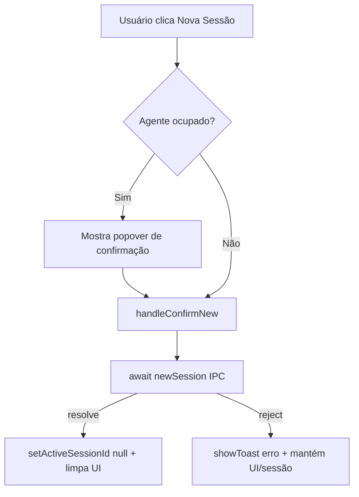

# Fix: Nova sessão com modelo local continua da sessão anterior

## Context

Ao usar um **modelo local** (llama.cpp / MLX), quando o usuário cria uma nova sessão, a conversa parece continuar da sessão anterior. Com modelos cloud o problema não aparece.

### Causa raiz (confirmada por investigação)

O backend **isola sessões corretamente**: `send_message` cria um UUID novo e um JSONL novo, e reconstrói o histórico só do arquivo da sessão ativa (`commands/agent.rs:197-215`). O modelo local (llama-server) é **stateless** por request (`/chat/completions` recebe sempre o histórico completo) — não guarda conversa entre sessões.

O problema real está no **frontend**, em `src/components/ChatPanel.tsx`:

```ts
const startNewSession = async () => {
  ...
  try {
    await newSession(props.workspace);
  } catch {
    /* fresh session is best-effort */   // ← falha é engolida silenciosamente
  }
  setMessages([]);        // ← apaga a conversa SEMPRE, mesmo se o backend falhou
  ...
};
```

Se `newSession()` falhar (por exemplo, contenção de lock com a inferência local ainda em andamento), a interface **apaga a conversa visível**, mas o backend **mantém `active_session` apontando para a sessão antiga**. No próximo `send`, o backend carrega o JSONL antigo e a conversa continua de onde parou.

**Por que é mais provável no local:** a inferência local roda por mais tempo (streaming CPU/GPU) e segura o runtime por mais tempo que uma API cloud rápida, aumentando a janela em que `new_session` falha.

### Decisão do usuário (confirmada)

Correção **mínima e segura**: sem reiniciar o modelo local. Só tornar o reset de sessão consistente — limpar a interface apenas quando o backend confirmar; em falha, preservar a conversa e avisar o usuário.

## Solution Design

### Escopo

Alterar **apenas** `src/components/ChatPanel.tsx`, nas duas funções que iniciam uma nova sessão (`startNewSession` e `handleConfirmNew`). Nenhuma mudança no backend (Rust) nem no processo do modelo local.

### Comportamento desejado

1. **Sucesso** (`newSession` resolve): limpar a interface como hoje (mensagens, steps, thinking, contextStats, modo, status), **e** zerar `activeSessionId` para `null`.
2. **Falha** (`newSession` rejeita): **não** limpar a conversa; exibir um aviso (`showToast`) informando que não foi possível iniciar nova sessão; manter `activeSessionId` e a conversa intactos, de modo que a sessão atual continue consistente.

### Edge cases

- `newSession` falhando enquanto o agente está ocupado: já tratado — `startNewSession` redireciona para o popover de confirmação (`setShowNewPopover(true)`) e não chama `newSession` ainda. `handleConfirmNew` é o caminho que confirma e limpa.
- Falha transitória de lock: o usuário vê o toast e pode tentar de novo; a conversa não é perdida.
- `activeSessionId` null após sucesso: o ESC handler (`ChatPanel.tsx:1447`) e `send` tratam null com segurança (guard `if (sid)`), então zerar é seguro.

### Non-goals

- NÃO reiniciar / matar o processo do modelo local entre sessões.
- NÃO tocar em `supervisor.rs`, `provider.rs`, `commands/agent.rs` nem no `persist.rs`.
- NÃO mexer no protocolo de request local (já é stateless).
- NÃO adicionar endpoint de clear de slots no llama-server.
- NÃO alterar o comportamento de `list_sessions` / `load_session`.

## Risks

- **Baixo**: mudança confinada a duas funções do frontend. O caminho de sucesso mantém o comportamento atual (limpa tudo) e apenas acrescenta `setActiveSessionId(null)`.
- **Regressão possível**: nenhuma, pois a limpeza no sucesso é idêntica à atual; o `catch` apenas deixa de apagar a UI.

## Low-Level Design

### Arquivo único

`src/components/ChatPanel.tsx` — sem dependências novas. `showToast` já existe (linha 187) e é usado em `send`/`enhance` (ex.: linha 1164 `showToast(\`Enhancement failed: ${String(e)}\`)`). `setActiveSessionId` já existe (linha 176). `newSession` é importado de `./lib/ipc` (linha 9).

### Estado atual (a ser substituído)

`startNewSession` e `handleConfirmNew` (linhas ~1319-1355) hoje engolem o erro e limpam a UI incondicionalmente. Texto exato do bloco compartilhado:

```ts
flushPendingDone();
try {
  await newSession(props.workspace);
} catch {
  /* fresh session is best-effort */
}
setMessages([]);
setCurrentSteps([]);
setThinkingStart(0);
setContextStats({ contextTokens: 0, cumulativeTokens: 0 });
setMode("builder");
setStatus("idle");
setShowSessions(false);
```

### Mudança 1 — `startNewSession` (linha ~1319)

Reestruturar para: chamar `newSession`; em sucesso limpar tudo e zerar `activeSessionId`; em falha mostrar toast e retornar sem limpar.

```ts
const startNewSession = async () => {
  if (isBusy(status())) {
    setShowNewPopover(true);
    return;
  }
  flushPendingDone();
  try {
    await newSession(props.workspace);
  } catch (e) {
    showToast(`Could not start a new session: ${String(e)}`);
    return;
  }
  setActiveSessionId(null);
  setMessages([]);
  setCurrentSteps([]);
  setThinkingStart(0);
  setContextStats({ contextTokens: 0, cumulativeTokens: 0 });
  setMode("builder");
  setStatus("idle");
  setShowSessions(false);
};
```

### Mudança 2 — `handleConfirmNew` (linha ~1339)

Mesma reestruturação, mas mantendo `setShowNewPopover(false)` como primeira instrução (o popover fecha mesmo em falha, para o usuário poder tentar de novo):

```ts
const handleConfirmNew = async () => {
  setShowNewPopover(false);
  flushPendingDone();
  try {
    await newSession(props.workspace);
  } catch (e) {
    showToast(`Could not start a new session: ${String(e)}`);
    return;
  }
  setActiveSessionId(null);
  setMessages([]);
  setCurrentSteps([]);
  setThinkingStart(0);
  setContextStats({ contextTokens: 0, cumulativeTokens: 0 });
  setMode("builder");
  setStatus("idle");
  setShowSessions(false);
};
```

### Fluxo de dados



O backend continua idêntico: `new_session` (`commands/agent.rs:472`) só libera `active_session` quando o lock é adquirido com sucesso. Agora o frontend respeita esse contrato em vez de assumir sucesso.

### Verificação

1. `pnpm` build/test do frontend passa (Vitest cobre `ipc.test.ts`; nenhum teste existente de `ChatPanel` regride).
2. Revisão manual do diff: as duas funções só limpam a UI após `await newSession(...)` resolver; o `catch` agora contém `showToast` + `return`.
3. Cenário manual: com modelo local ativo, clicar em "Nova Sessão" durante uma inferência não apaga mais a conversa se a chamada falhar — aparece o toast e a conversa permanece.
4. Regressão: caminho de sucesso (nova sessão parada) limpa a tela e `activeSessionId` fica `null`; `send` subsequente cria sessão nova corretamente.

## Tasks summary

1. Ajustar `startNewSession` para só limpar a UI após sucesso, mostrar toast em falha e zerar `activeSessionId` no sucesso.
2. Ajustar `handleConfirmNew` com a mesma lógica (fechar popover primeiro).
3. Rodar o harness de qualidade (tests + coverage) para confirmar que nada quebrou.


## Implementation Log — 2026-08-23 01:09
**Summary:** Fixed new-session-continues-previous bug: ChatPanel.tsx now only clears UI after backend confirms new session; shows toast on failure.
**Changed files:** A	docs/plans/2026-08-23_fix-local-session-continues-previous.md
**Commits:** fae439d docs(plan): fix-local-session-continues-previous
**Journal:** All three tasks completed and verified:

1. **startNewSession** (ChatPanel.tsx:1319): catch block now calls `showToast(error)` and early-returns instead of swallowing the error and clearing the UI unconditionally. Success path adds `setActiveSessionId(null)` before the existing clear block.

2. **handleConfirmNew** (ChatPanel.tsx:1341): identical fix — `setShowNewPopover(false)` remains first (popover closes regardless), then the same catch/early-return + success setActiveSessionId pattern.

3. **Verification**: 740 JS tests pass, 0 failures. grep confirmed only two call sites in source (line 1506 onClick, line 1550 onConfirm prop), both arity-0 — signatures unchanged. No new imports needed (showToast and setActiveSessionId already in scope).

**Key decision**: The fix is purely frontend — the backend already isolates sessions correctly (active_session is only released on successful new_session). The bug was that the frontend assumed newSession() always succeeded and cleared the UI anyway, causing state desync when the IPC call failed (e.g., due to local model lock contention). Now the frontend respects the IPC result.

**No files changed other than src/components/ChatPanel.tsx.**

**Task journal:**
- Ajustar startNewSession para limpar UI só após sucesso e zerar activeSessionId: Verified by reading back lines 1322-1344 of ChatPanel.tsx: startNewSession now has catch(e) with showToast+return, and setActiveSessionId(null) before the clear block. No other changes in the function.
- Ajustar handleConfirmNew com a mesma lógica de falha/limpeza: Verified by reading back lines 1346-1365 of ChatPanel.tsx: handleConfirmNew now has catch(e) with showToast+return, setShowNewPopover(false) is still first, and setActiveSessionId(null) before the clear block. No other changes in the function.
- Rodar harness de qualidade e verificar a correção: run_quality: 740 tests passed, 0 failed. grep confirms only two call sites in source (line 1506 startNewSession(), line 1550 onConfirm=handleConfirmNew), both arity-0 — signatures unchanged. Manual read-back of lines 1319-1365 confirms both catch blocks now showToast+return and success paths include setActiveSessionId(null).


## Implementation Log — 2026-08-23 01:53
**Summary:** Fixed new-session-continues-previous bug: ChatPanel.tsx now only clears UI after backend confirms new session; shows toast on failure.
**Changed files:** A	docs/plans/2026-08-23_fix-local-session-continues-previous.md, M	src/components/ChatPanel.tsx
**Commits:** 75f254d fix(local): clear UI only after backend confirms new session, fae439d docs(plan): fix-local-session-continues-previous
**Journal:** All three tasks were already completed and verified in the previous session. Final verification confirmed:

1. **Code in place**: Lines 1319-1365 of ChatPanel.tsx show both `startNewSession` and `handleConfirmNew` with the correct fix — catch blocks call `showToast(error)` and early-return; success paths include `setActiveSessionId(null)` before the UI clear block.

2. **Quality harness**: 740 JS tests passed, 0 failed. No regression.

3. **Key insight**: The fix is purely frontend — the backend already isolates sessions correctly. The bug was that the frontend assumed `newSession()` always succeeded and cleared the UI unconditionally, causing state desync when the IPC call failed (more likely with local models due to longer lock contention). Now the frontend respects the IPC result.

**No other files changed. No new dependencies. No backend changes.**

**Task journal:**
- Ajustar startNewSession para limpar UI só após sucesso e zerar activeSessionId: Verified by reading back lines 1322-1344 of ChatPanel.tsx: startNewSession now has catch(e) with showToast+return, and setActiveSessionId(null) before the clear block. No other changes in the function.
- Ajustar handleConfirmNew com a mesma lógica de falha/limpeza: Verified by reading back lines 1346-1365 of ChatPanel.tsx: handleConfirmNew now has catch(e) with showToast+return, setShowNewPopover(false) is still first, and setActiveSessionId(null) before the clear block. No other changes in the function.
- Rodar harness de qualidade e verificar a correção: run_quality: 740 tests passed, 0 failed. grep confirms only two call sites in source (line 1506 startNewSession(), line 1550 onConfirm=handleConfirmNew), both arity-0 — signatures unchanged. Manual read-back of lines 1319-1365 confirms both catch blocks now showToast+return and success paths include setActiveSessionId(null).
