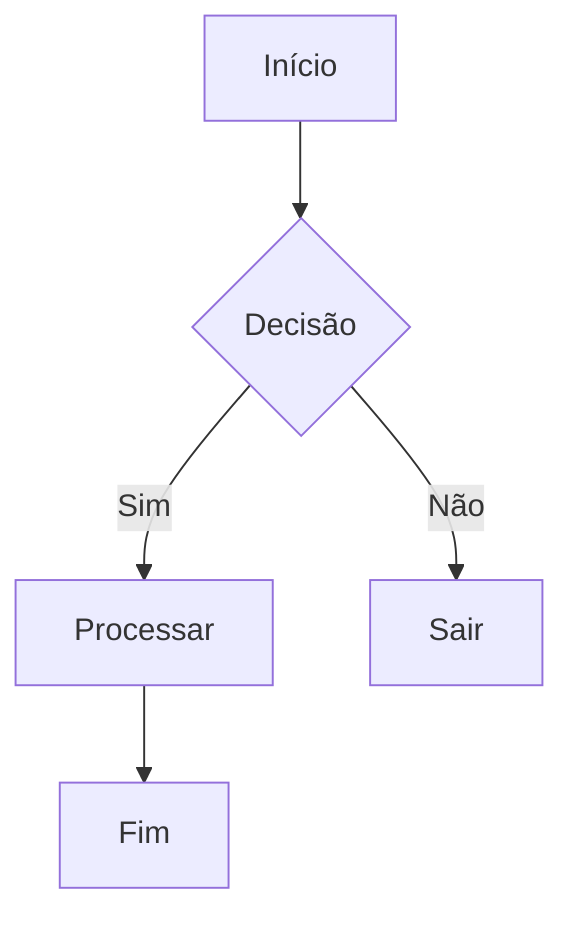
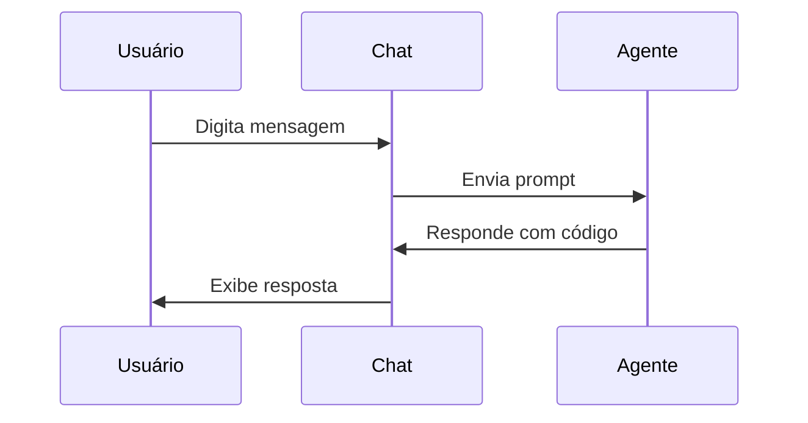
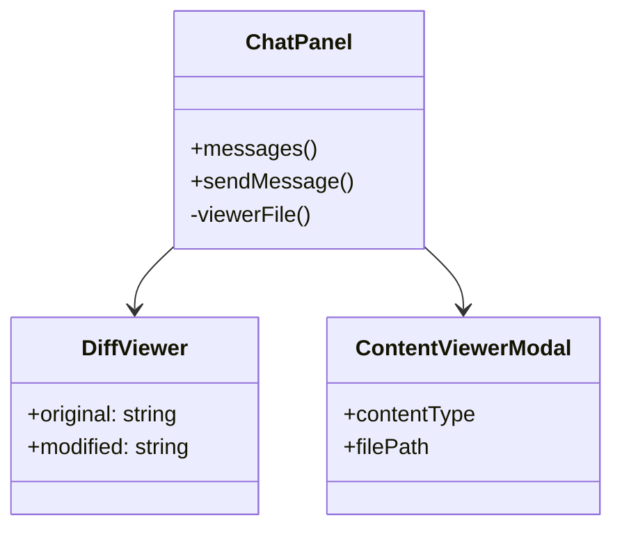
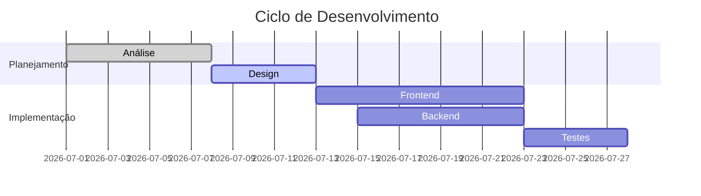

# Exemplos de Diagramas Mermaid para Testar no Chat

Copie e cole um destes blocos no chat do Claudinio Code para testar a renderização:

---

## Exemplo 1: Fluxograma simples



---

## Exemplo 2: Diagrama de sequência



---

## Exemplo 3: Diagrama de classes



---

## Exemplo 4: Diagrama de Gantt (cronograma)



---

## Instruções

1. Copie qualquer bloco ```mermaid ...``` acima
2. Cole no campo de texto do chat
3. Envie a mensagem
4. O diagrama deve aparecer renderizado inline
5. Clique no diagrama para abrir o visualizador em tela cheia (zoom/pan)
